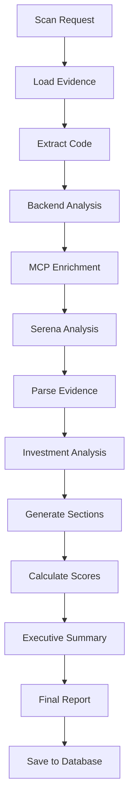

# TechScanIQ LangGraph Architecture Analysis

## Overview

TechScanIQ has evolved from simple worker-based processing to a sophisticated LangGraph-based architecture that orchestrates complex AI-driven analysis workflows. This document provides a deep dive into the current LangGraph implementation.

## Current Architecture (v4-backend)

### 1. Core Components

#### 1.1 State Management
The system uses LangGraph's `Annotation` system for comprehensive state management:

```typescript
const ResearchState = Annotation.Root({
  // Company information
  company: Annotation<string>(),
  domain: Annotation<string>(),
  investmentThesis: Annotation<string>(),
  scanRequestId: Annotation<string>(),
  
  // Evidence collection
  evidenceCollected: Annotation<any[]>(),
  evidenceByType: Annotation<Record<string, any[]>>(),
  totalEvidence: Annotation<number>(),
  
  // Code analysis from backend
  backendCodeAnalysis: Annotation<any>(),
  extractedCode: Annotation<Record<string, string>>(),
  
  // MCP tool results
  mcpToolResults: Annotation<Record<string, any>>(),
  repositoryAnalysis: Annotation<any>(),
  codebaseInsights: Annotation<any>(),
  
  // Analysis results
  parsedData: Annotation<any>(),
  sectionAnalyses: Annotation<Record<string, any>>(),
  
  // Citations
  citations: Annotation<any[]>(),
  citationMap: Annotation<Record<string, number>>(),
  
  // Report sections
  reportSections: Annotation<Record<string, any>>(),
  executiveSummary: Annotation<string>(),
  
  // Scoring
  investmentScore: Annotation<number>(),
  techHealthScore: Annotation<number>(),
  confidenceScore: Annotation<number>(),
  
  // Metadata
  analysisTrace: Annotation<any[]>(),
  errors: Annotation<string[]>(),
  currentPhase: Annotation<string>(),
  availableTools: Annotation<Tool[]>()
})
```

#### 1.2 Graph Nodes

The workflow consists of the following nodes:

1. **loadEvidence** - Loads evidence from Supabase database
2. **extractCodeNode** - Extracts code snippets from evidence
3. **analyzeCodeWithBackend** - Sends code to Python backend for analysis
4. **enrichWithMCP** - Uses MCP tools for additional data gathering
5. **analyzeCodebase** - Performs semantic code analysis (if Serena available)
6. **parseEvidence** - Structures evidence for analysis
7. **analyzeInvestmentThesis** - Evaluates against investment criteria
8. **generateSections** - Creates report sections
9. **calculateScores** - Computes various scoring metrics
10. **generateExecutiveSummary** - Creates high-level summary
11. **compileFinalReport** - Assembles complete report

#### 1.3 Edge Configuration

```typescript
graph
  .addEdge('loadEvidence', 'extractCodeNode')
  .addEdge('extractCodeNode', 'analyzeCodeWithBackend')
  .addEdge('analyzeCodeWithBackend', 'enrichWithMCP')
  .addEdge('enrichWithMCP', 'analyzeCodebase')
  .addEdge('analyzeCodebase', 'parseEvidence')
  .addEdge('parseEvidence', 'analyzeInvestmentThesis')
  .addEdge('analyzeInvestmentThesis', 'generateSections')
  .addEdge('generateSections', 'calculateScores')
  .addEdge('calculateScores', 'generateExecutiveSummary')
  .addEdge('generateExecutiveSummary', 'compileFinalReport')
```

### 2. Integration Points

#### 2.1 Backend Integration
- **Endpoint**: `http://localhost:8000/api/code-analysis/analyze`
- **Purpose**: Leverages Python-based code analysis tools
- **Features**:
  - Security scanning
  - Framework detection
  - Dependency analysis
  - Symbol extraction

#### 2.2 MCP (Model Context Protocol) Integration
- **Tools Available**:
  - Filesystem operations (read_file, search_files)
  - Git operations (git_status, git_log)
  - Web fetching (fetch_url)
  - Serena code analysis (when enabled)

#### 2.3 AI Integration
- **Primary**: Anthropic Claude (via SDK)
- **Tool Calling**: Structured output generation
- **Context Management**: Evidence-based prompting

### 3. Data Flow



### 4. Key Features

#### 4.1 Progressive Enhancement
- Each node adds value but isn't critical
- Graceful degradation if services unavailable
- Error collection without stopping workflow

#### 4.2 Citation Management
- Automatic citation tracking
- Evidence-to-insight linking
- Source verification

#### 4.3 Comprehensive Scoring
```typescript
- investmentScore: Overall investment viability
- techHealthScore: Technical infrastructure quality
- confidenceScore: Analysis confidence level
```

#### 4.4 Analysis Trace
- Complete audit trail of processing steps
- Timing information for performance monitoring
- Error tracking and debugging support

### 5. Tool Integration Architecture

#### 5.1 MCP Tools
```typescript
// Tool initialization
mcpClient = await MCPClient.createDefault()
mcpTools = await createFilteredMCPTools(['filesystem', 'git', 'web'], mcpClient)

// Tool categories:
- Filesystem: read_file, list_directory, search_files
- Git: git_status, git_log, git_diff
- Web: fetch_url
```

#### 5.2 Serena Tools (Code Analysis)
```typescript
serenaTools = createSerenaTools(mcpClient)

// Available tools:
- analyze_code_structure
- find_symbols
- detect_security_issues
- analyze_dependencies
```

### 6. Error Handling Strategy

1. **Node-Level**: Each node catches and logs errors
2. **State Preservation**: Errors added to state.errors array
3. **Graceful Degradation**: Processing continues despite failures
4. **Error Reporting**: Final report includes error summary

### 7. Performance Optimizations

1. **Parallel Processing**: Where possible, independent operations run concurrently
2. **Caching**: MCP results cached within workflow
3. **Timeout Management**: Each external call has timeout limits
4. **Resource Limits**: Code extraction limited to prevent memory issues

### 8. Extensibility Points

1. **New Nodes**: Easy to add new analysis steps
2. **Tool Plugins**: MCP allows new tool servers
3. **Scoring Algorithms**: Pluggable scoring modules
4. **Report Templates**: Customizable output formats

## Migration Path from Legacy

### From Basic Workers to LangGraph

1. **Phase 1**: Basic worker → LangGraph v1
   - Simple node-based workflow
   - Basic state management

2. **Phase 2**: LangGraph v2
   - Enhanced state with annotations
   - Better error handling

3. **Phase 3**: LangGraph v3 + MCP
   - Tool integration
   - External service calls

4. **Phase 4**: LangGraph v4 + Backend (Current)
   - Python backend integration
   - Full-featured analysis pipeline

## Best Practices

1. **State Management**
   - Use reducers for complex state updates
   - Default values for all annotations
   - Immutable state updates

2. **Error Handling**
   - Never throw in nodes (use state.errors)
   - Log all errors with context
   - Continue processing when possible

3. **Tool Usage**
   - Check tool availability before use
   - Handle tool failures gracefully
   - Cache tool results when appropriate

4. **Performance**
   - Limit concurrent operations
   - Set reasonable timeouts
   - Monitor memory usage

## Future Enhancements

1. **Streaming Support**: Real-time progress updates
2. **Distributed Processing**: Multi-worker graph execution
3. **Custom Tool Development**: Domain-specific MCP tools
4. **ML Model Integration**: Custom models for specialized analysis
5. **Advanced Caching**: Redis-based result caching

## Conclusion

The LangGraph architecture provides a robust, extensible framework for complex AI-driven analysis workflows. The v4-backend implementation represents the current state-of-the-art, combining:

- Structured workflow management
- External tool integration
- Comprehensive error handling
- Performance optimization
- Clear extensibility points

This architecture positions TechScanIQ for continued growth and enhancement while maintaining code clarity and maintainability.