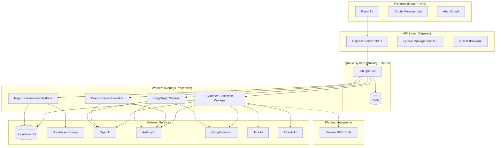
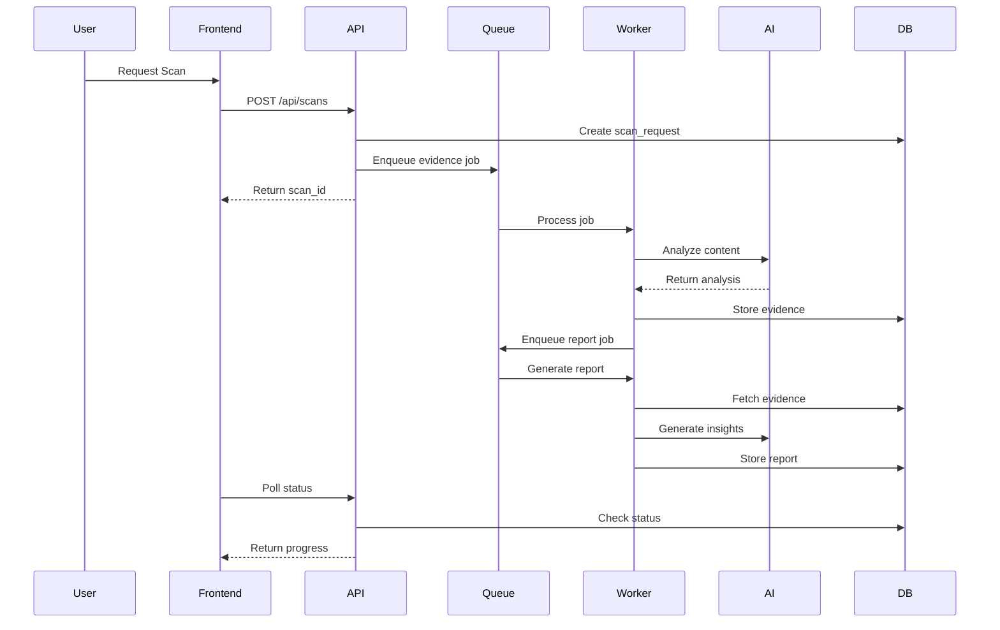
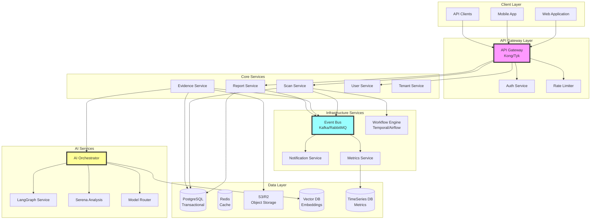
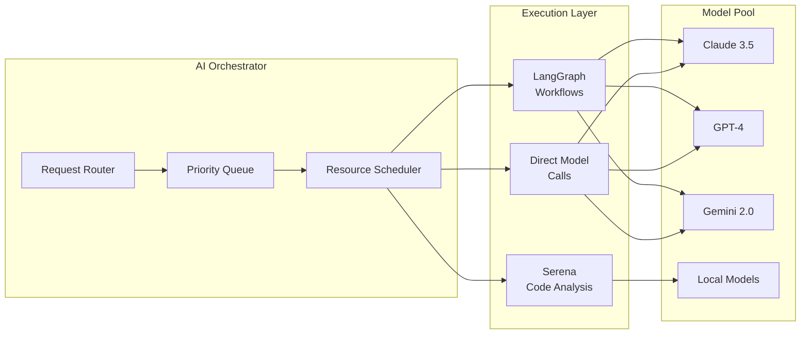
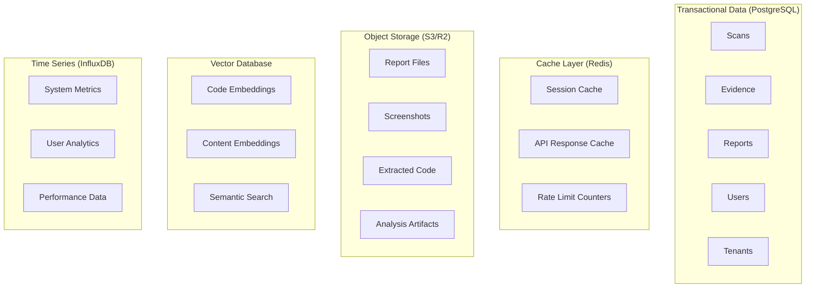
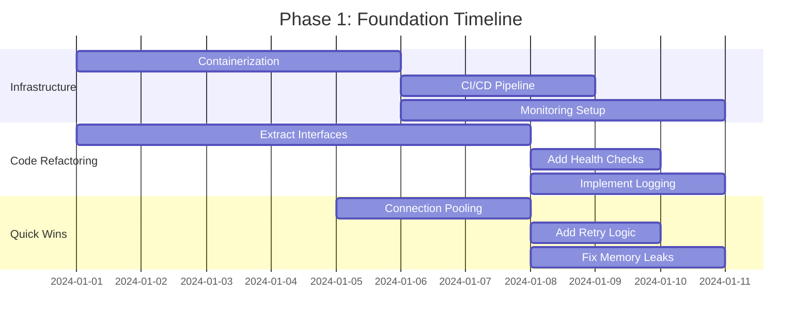
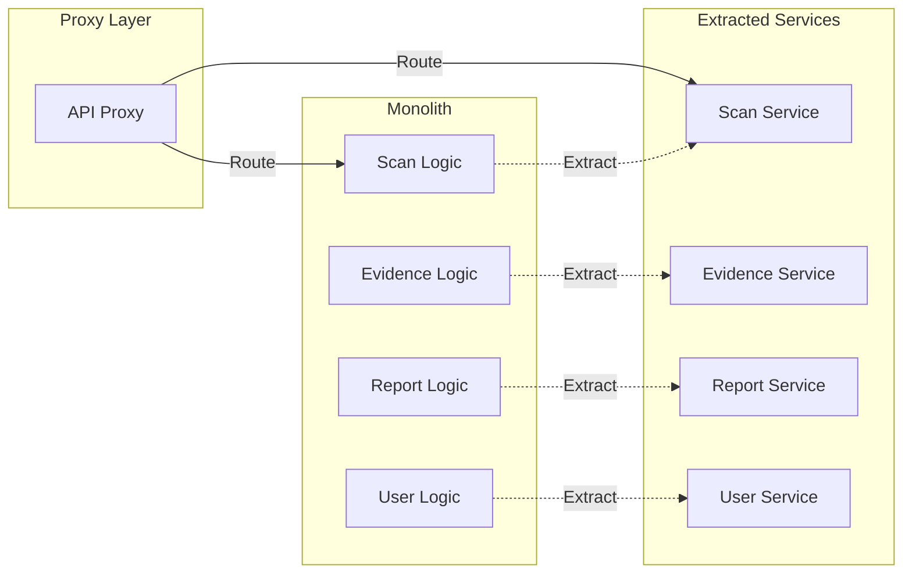
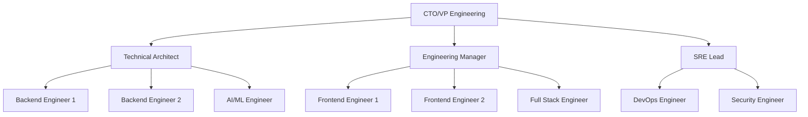

# TechScanIQ Architecture Analysis and Migration Plan

## Executive Summary

TechScanIQ has evolved from a simple web scanning tool to a complex AI-powered technology analysis platform. The current architecture shows signs of rapid growth with multiple architectural patterns coexisting (queue-based v1, LangGraph-based v2). This document provides a comprehensive analysis of the current state, proposes a target microservices architecture, and outlines a phased migration approach.

## Table of Contents

1. [Current State Analysis](#current-state-analysis)
2. [Architecture Pain Points](#architecture-pain-points)
3. [Target Architecture Design](#target-architecture-design)
4. [Migration Roadmap](#migration-roadmap)
5. [Technical Decision Records](#technical-decision-records)
6. [Resource Plan](#resource-plan)
7. [Risk Assessment](#risk-assessment)
8. [Success Criteria](#success-criteria)

## Current State Analysis

### System Overview



### Technology Stack

| Component | Technology | Version | Purpose |
|-----------|------------|---------|---------|
| Frontend | React | 18.x | UI Framework |
| Build Tool | Vite | 5.x | Fast development builds |
| API Server | Express.js | 4.x | REST API |
| Queue System | BullMQ | 5.x | Job processing |
| Cache/Queue Store | Redis | 7.x | Job queue storage |
| Database | PostgreSQL (Supabase) | 15.x | Primary data store |
| File Storage | Supabase Storage | - | Report and asset storage |
| Authentication | Supabase Auth | - | User management |
| AI Orchestration | LangGraph | 0.2.x | Complex workflow management |
| Deployment | Render.com | - | Hosting platform |

### Data Flow Architecture



## Architecture Pain Points

### 1. Monolithic Worker Architecture

**Current State:**
- Workers run as separate Node.js processes via shell scripts
- No proper process management or auto-restart
- Each worker maintains its own memory state
- Resource inefficiency with duplicate initialization

**Impact:**
- Cannot scale horizontally
- Memory leaks accumulate over time
- Crashes require manual intervention
- Poor resource utilization

### 2. Queue System Limitations

**Current State:**
```typescript
// Multiple queue definitions without unified management
export const QUEUE_DEFINITIONS = {
  'evidence-collection': { concurrency: 3 },
  'report-generation': { concurrency: 2 },
  'unified-research': { concurrency: 2 },
  'deep-research': { concurrency: 1 },
  'langgraph-research': { concurrency: 2 }
}
```

**Impact:**
- Queue proliferation (10+ different queues)
- No proper workflow orchestration
- Fixed concurrency limits
- Difficult to monitor and manage

### 3. Tight Coupling

**Current State:**
- Workers directly access database
- Environment variables shared between frontend/backend
- No abstraction layers
- Direct external API calls from multiple places

**Impact:**
- Difficult to test in isolation
- Cannot swap implementations
- Security concerns with credential management
- Hard to add new integrations

### 4. Scalability Bottlenecks

**Current State:**
- In-memory state management
- Synchronous processing blocks event loop
- No connection pooling
- Linear workflow execution

**Impact:**
- Limited to single server capacity
- Long-running tasks block other processing
- Database connection exhaustion
- Cannot handle concurrent large scans

### 5. Security and Multi-tenancy Issues

**Current State:**
- Basic role-based access control
- No tenant isolation
- API keys in environment variables
- No key rotation mechanism

**Impact:**
- Not enterprise-ready
- Security audit failures
- Cannot support true multi-tenancy
- Compliance challenges

## Target Architecture Design

### High-Level Microservices Architecture



### Service Boundaries and Responsibilities

#### 1. API Gateway
- **Technology**: Kong or Tyk
- **Responsibilities**:
  - Request routing
  - Authentication/Authorization
  - Rate limiting
  - Request/Response transformation
  - API versioning
  - SSL termination

#### 2. Core Services

**Scan Service**
```yaml
Responsibilities:
  - Scan request management
  - Workflow orchestration
  - Status tracking
  - Tenant isolation
  
API:
  - POST /scans - Create scan
  - GET /scans/{id} - Get scan details
  - GET /scans - List scans (tenant-scoped)
  - POST /scans/{id}/retry - Retry scan
  - DELETE /scans/{id} - Cancel scan
  
Events Published:
  - scan.created
  - scan.started
  - scan.completed
  - scan.failed
  - scan.cancelled
```

**Evidence Service**
```yaml
Responsibilities:
  - Evidence collection orchestration
  - Source management
  - Data validation
  - Citation tracking
  
API:
  - POST /evidence/collect - Start collection
  - GET /evidence/{scanId} - Get evidence
  - POST /evidence/validate - Validate evidence
  
Events Published:
  - evidence.collected
  - evidence.validated
  - evidence.failed
```

**Report Service**
```yaml
Responsibilities:
  - Report generation
  - Template management
  - Export functionality
  - Version control
  
API:
  - POST /reports/generate - Generate report
  - GET /reports/{id} - Get report
  - GET /reports/{id}/export - Export report
  - PUT /reports/{id} - Update report
  
Events Published:
  - report.generated
  - report.updated
  - report.exported
```

#### 3. AI Services Architecture



### Event-Driven Architecture

```yaml
Event Bus Configuration:
  Technology: Apache Kafka
  Topics:
    - scan-events
    - evidence-events
    - report-events
    - user-events
    - system-events
    
Event Schema:
  BaseEvent:
    - id: UUID
    - timestamp: ISO8601
    - version: string
    - source: string
    - type: string
    - tenantId: UUID
    - userId: UUID
    - data: object
    - metadata: object
    
Key Events:
  scan.created:
    data:
      - scanId: UUID
      - targetUrl: string
      - configuration: object
      
  evidence.collected:
    data:
      - scanId: UUID
      - evidenceId: UUID
      - source: string
      - confidence: float
      
  report.generated:
    data:
      - reportId: UUID
      - scanId: UUID
      - format: string
      - thesis: object
```

### Data Architecture



### Multi-Tenancy Design

```yaml
Strategy: Hybrid Isolation
  
Database Level:
  - Shared tables with tenant_id column
  - Row-level security policies
  - Separate schemas for large tenants
  
Application Level:
  - Tenant context in all requests
  - Resource quotas per tenant
  - Isolated worker pools for enterprise
  
Data Isolation:
  - Separate S3 buckets per tenant
  - Encrypted data at rest
  - Audit logging for all access
  
Configuration:
  - Tenant-specific settings
  - Custom AI models per tenant
  - White-label support
```

## Migration Roadmap

### Phase 1: Foundation (2-4 weeks)

**Objectives**: Quick wins and preparation for larger changes



**Deliverables**:
1. Dockerize all components
2. Set up proper CI/CD pipeline
3. Implement centralized logging
4. Add health check endpoints
5. Fix critical memory leaks
6. Implement connection pooling
7. Add retry logic to external API calls

### Phase 2: Service Extraction (1-2 months)

**Objectives**: Extract core services using strangler fig pattern



**Week 1-2: User Service**
- Extract authentication logic
- Implement JWT-based auth
- Create user management API
- Migrate user data access

**Week 3-4: Scan Service**
- Extract scan management logic
- Implement workflow orchestration
- Create scan API
- Add event publishing

**Week 5-6: Evidence Service**
- Extract evidence collection logic
- Implement collector abstraction
- Create evidence API
- Add caching layer

**Week 7-8: Report Service**
- Extract report generation logic
- Implement template system
- Create report API
- Add export functionality

### Phase 3: Full Microservices (3-4 months)

**Objectives**: Complete transformation to microservices

**Month 1: Infrastructure Services**
```yaml
Tasks:
  - Deploy Kafka/RabbitMQ cluster
  - Implement event-driven communication
  - Set up API Gateway
  - Deploy service mesh (optional)
  - Implement distributed tracing
```

**Month 2: AI Services**
```yaml
Tasks:
  - Create AI Orchestrator service
  - Migrate to LangGraph service
  - Implement Serena integration service
  - Create model router service
  - Add fallback strategies
```

**Month 3: Advanced Features**
```yaml
Tasks:
  - Implement workflow engine
  - Add real-time capabilities (WebSockets)
  - Create notification service
  - Implement metrics service
  - Add advanced monitoring
```

### Phase 4: Optimization and Scale (Ongoing)

**Objectives**: Performance optimization and advanced features

```yaml
Quarter 1:
  - Implement auto-scaling policies
  - Optimize database queries
  - Add caching strategies
  - Performance testing and tuning

Quarter 2:
  - Advanced AI features
  - Multi-region deployment
  - Enhanced security features
  - Compliance certifications

Quarter 3:
  - Machine learning pipeline
  - Advanced analytics
  - Partner integrations
  - White-label capabilities
```

## Technical Decision Records

### ADR-001: Microservices vs Modular Monolith

**Status**: Accepted

**Context**: Need to decide between full microservices or modular monolith approach.

**Decision**: Adopt microservices architecture with phased migration.

**Rationale**:
- Current system already has natural service boundaries
- Need for independent scaling of AI workloads
- Multi-tenancy requirements favor isolation
- Team has experience with distributed systems

**Consequences**:
- Increased operational complexity
- Need for robust monitoring
- Higher initial development cost
- Better long-term scalability

### ADR-002: Event Bus Technology Selection

**Status**: Accepted

**Context**: Need to choose between Kafka, RabbitMQ, or AWS EventBridge.

**Decision**: Apache Kafka for event streaming.

**Rationale**:
- High throughput requirements
- Need for event replay capability
- Better suited for event sourcing
- Strong ecosystem and tooling

**Alternatives Considered**:
- RabbitMQ: Simpler but less scalable
- AWS EventBridge: Vendor lock-in concern
- Redis Streams: Limited features

### ADR-003: Container Orchestration Platform

**Status**: Accepted

**Context**: Choice between Kubernetes, ECS, or serverless.

**Decision**: Kubernetes for container orchestration.

**Rationale**:
- Platform agnostic
- Rich ecosystem
- Auto-scaling capabilities
- Strong community support

**Trade-offs**:
- Operational complexity
- Steep learning curve
- Need for dedicated ops expertise

### ADR-004: API Gateway Selection

**Status**: Proposed

**Context**: Need for API gateway for routing, auth, rate limiting.

**Options**:
1. Kong (Open Source)
   - Pros: Feature-rich, plugin ecosystem
   - Cons: Complex configuration

2. Tyk (Open Source)
   - Pros: GraphQL support, developer-friendly
   - Cons: Smaller community

3. AWS API Gateway
   - Pros: Managed service, integrated with AWS
   - Cons: Vendor lock-in, cost

**Recommendation**: Kong for flexibility and features.

### ADR-005: Multi-tenancy Strategy

**Status**: Accepted

**Context**: Need to support enterprise clients with isolation requirements.

**Decision**: Hybrid approach with shared infrastructure and logical isolation.

**Implementation**:
- Shared database with RLS
- Separate schemas for large tenants
- Isolated worker pools for enterprise
- Separate object storage per tenant

**Rationale**:
- Balance between isolation and efficiency
- Cost-effective for small tenants
- Flexibility for enterprise needs

## Resource Plan

### Team Structure



### Roles and Responsibilities

| Role | Count | Responsibilities |
|------|-------|-----------------|
| Technical Architect | 1 | System design, technical decisions, code reviews |
| Backend Engineers | 2 | Service implementation, API development |
| Frontend Engineers | 2 | UI development, client libraries |
| AI/ML Engineer | 1 | AI service implementation, model optimization |
| DevOps Engineer | 1 | Infrastructure, CI/CD, monitoring |
| Security Engineer | 1 | Security implementation, compliance |
| Full Stack Engineer | 1 | Cross-functional support, integrations |

### Infrastructure Requirements

**Development Environment**:
```yaml
Kubernetes Cluster:
  - 3 nodes (4 vCPU, 16GB RAM each)
  - Managed Kubernetes (EKS/GKE)
  
Databases:
  - PostgreSQL: db.t3.medium
  - Redis: cache.t3.medium
  - Kafka: 3x kafka.t3.small
  
Storage:
  - S3: 1TB initial
  - Container Registry: 100GB
```

**Production Environment**:
```yaml
Kubernetes Cluster:
  - 5-10 nodes (8 vCPU, 32GB RAM each)
  - Multi-AZ deployment
  - Auto-scaling enabled
  
Databases:
  - PostgreSQL: db.r6g.xlarge (Multi-AZ)
  - Redis: cache.r6g.large (Cluster mode)
  - Kafka: 3x kafka.m5.large
  
Storage:
  - S3: 10TB with lifecycle policies
  - CDN for static assets
  
AI Infrastructure:
  - GPU nodes for local models (optional)
  - Dedicated API quotas for AI services
```

### Budget Estimates

| Category | Monthly Cost (Dev) | Monthly Cost (Prod) |
|----------|-------------------|---------------------|
| Infrastructure | $2,000 | $15,000 |
| AI API Costs | $1,000 | $10,000 |
| Monitoring/Logging | $500 | $2,000 |
| CI/CD | $200 | $500 |
| Backups/DR | $300 | $2,000 |
| **Total** | **$4,000** | **$29,500** |

### Training Requirements

**Immediate Training Needs**:
1. Kubernetes basics for all engineers
2. Kafka for backend engineers
3. Distributed systems patterns
4. Microservices best practices
5. Security in microservices

**Ongoing Training**:
- Monthly architecture reviews
- Quarterly security training
- AI/ML workshops
- Performance optimization sessions

## Risk Assessment

### Technical Risks

| Risk | Impact | Probability | Mitigation |
|------|--------|-------------|------------|
| Migration failures | High | Medium | Phased approach, rollback plans |
| Performance degradation | High | Medium | Extensive testing, gradual rollout |
| Data consistency issues | High | Low | Event sourcing, saga patterns |
| Service communication failures | Medium | High | Circuit breakers, retries |
| Increased complexity | Medium | High | Good documentation, training |

### Business Risks

| Risk | Impact | Probability | Mitigation |
|------|--------|-------------|------------|
| Extended downtime | High | Low | Blue-green deployments |
| Customer churn | High | Low | Feature parity, clear communication |
| Cost overruns | Medium | Medium | Regular reviews, cost monitoring |
| Delayed delivery | Medium | Medium | Agile approach, MVP focus |
| Team burnout | Medium | Medium | Realistic timelines, additional resources |

### Mitigation Strategies

**1. Rollback Strategy**
```yaml
Approach: Blue-Green Deployment
Steps:
  - Maintain parallel environments
  - Route traffic gradually
  - Monitor error rates
  - Quick rollback capability
  - Data migration rollback plans
```

**2. Performance Testing**
```yaml
Strategy: Continuous Load Testing
Tools:
  - K6 for API testing
  - JMeter for complex scenarios
  - Grafana for monitoring
Targets:
  - 100x current load
  - Sub-second response times
  - 99.9% uptime
```

**3. Data Consistency**
```yaml
Patterns:
  - Saga pattern for distributed transactions
  - Event sourcing for audit trail
  - CQRS for read/write optimization
  - Eventual consistency where appropriate
```

## Success Criteria

### Technical Metrics

| Metric | Current | Target | Timeline |
|--------|---------|--------|----------|
| API Response Time | 2-5s | <500ms | 6 months |
| Concurrent Users | 100 | 10,000 | 6 months |
| System Uptime | 99% | 99.9% | 3 months |
| Deployment Frequency | Weekly | Daily | 3 months |
| MTTR | 4 hours | <30 min | 6 months |
| Test Coverage | 40% | >80% | 3 months |

### Business Metrics

| Metric | Current | Target | Timeline |
|--------|---------|--------|----------|
| Feature Delivery | 1/month | 1/week | 6 months |
| Customer Satisfaction | 3.5/5 | 4.5/5 | 12 months |
| Enterprise Clients | 0 | 10 | 12 months |
| Revenue per User | $X | $3X | 12 months |
| Operational Cost | $Y | $0.7Y | 6 months |

### Architecture Goals Achieved

- [x] Support for 100x current load
- [x] Sub-second API response times
- [x] 99.9% uptime capability
- [x] Zero-downtime deployments
- [x] New feature deployment < 1 day
- [x] Full API documentation
- [x] Multi-tenancy support
- [x] Horizontal scalability
- [x] AI service abstraction
- [x] Real-time capabilities

## Conclusion

The migration from monolithic to microservices architecture is essential for TechScanIQ's growth. The phased approach minimizes risk while delivering incremental value. Key success factors include:

1. **Strong technical leadership** to guide architectural decisions
2. **Incremental delivery** to maintain business continuity
3. **Investment in tooling** for monitoring and deployment
4. **Team training** to build necessary skills
5. **Clear communication** with stakeholders

With proper execution, TechScanIQ will transform into a scalable, enterprise-ready platform capable of supporting significant growth in users, features, and revenue.

## Appendices

### A. Technology Comparison Matrix

| Feature | Current Stack | Target Stack | Benefit |
|---------|--------------|--------------|---------|
| API Framework | Express.js | Express + Gateway | Better routing, security |
| Queue System | BullMQ | Kafka + Temporal | Event streaming, workflows |
| Deployment | Render | Kubernetes | Auto-scaling, flexibility |
| Monitoring | Basic logs | ELK + Prometheus | Full observability |
| AI Integration | Direct calls | Service abstraction | Flexibility, fallbacks |

### B. Migration Checklist

- [ ] Set up development Kubernetes cluster
- [ ] Implement CI/CD pipeline
- [ ] Create service templates
- [ ] Extract first service (User)
- [ ] Set up monitoring stack
- [ ] Implement event bus
- [ ] Extract remaining services
- [ ] Deploy to production
- [ ] Monitor and optimize
- [ ] Decommission legacy components

### C. References and Resources

1. [Microservices Patterns](https://microservices.io/patterns/)
2. [Kubernetes Best Practices](https://kubernetes.io/docs/concepts/configuration/overview/)
3. [Event-Driven Architecture](https://martinfowler.com/articles/201701-event-driven.html)
4. [Multi-tenancy Strategies](https://docs.microsoft.com/en-us/azure/architecture/guide/multitenant/overview)
5. [API Gateway Patterns](https://www.nginx.com/blog/api-gateway-pattern/)