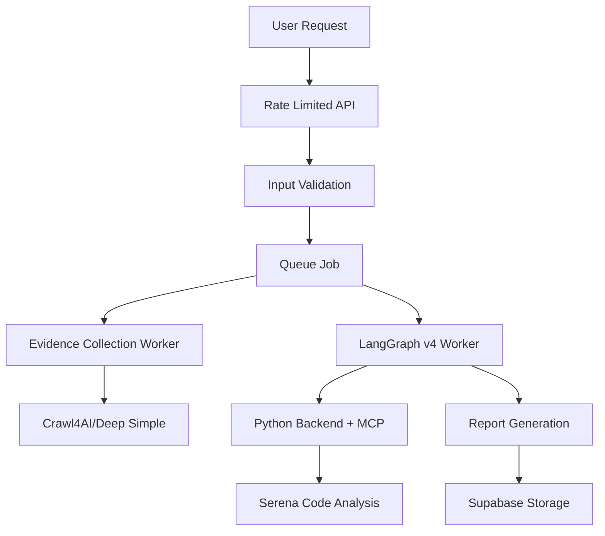

# TechScanIQ Modern Architecture (Post-Integration)

**Updated**: June 20, 2025 - DEV-002 & DEV-003 Integration Complete

## System Overview



## Active Components

### 1. Security Layer
- **Rate Limiting**: 100 requests per 15-minute window per IP (`src/lib/middleware/rate-limit.ts`)
- **Input Validation**: URL validation, private IP blocking in production (`src/lib/validation/input-validation.ts`)
- **Environment Validation**: Required environment variables checked on startup (`src/lib/config/env-validation.ts`)
- **Secure Headers**: X-Content-Type-Options, X-Frame-Options, X-XSS-Protection

### 2. Evidence Collection
- **Primary**: `evidence-collection-worker-crawl4ai.ts` - Modern web scraping with Crawl4AI
- **Alternative**: `evidence-collection-worker-deep-simple.ts` - Simplified deep scraping
- **Removed**: ❌ Jina-based evidence collection (deprecated)

### 3. Report Generation
- **Current**: `report-generation-worker-langgraph-v4-backend.ts` - LangGraph v4 with Python backend integration
- **Removed**: 
  - ❌ report-generation-worker-v2.ts
  - ❌ report-generation-worker-langgraph-v2.ts
  - ❌ report-generation-worker-langgraph-v3-mcp.ts
  - ❌ report-generation-worker-langgraph-v3-thesis.ts
  - ❌ Legacy Claude orchestrated workers

### 4. Backend Integration
- **Python Backend**: FastAPI backend (`techscaniq-v2/backend`)
  - Rate limiting: 10 requests per minute per IP
  - CORS: Restricted to approved origins
  - Trusted hosts middleware
  - Comprehensive security headers
- **MCP Server**: Communication with Serena code analysis tools
- **API Server**: Express server for job queue management

## Available Scripts

### Individual Workers
```bash
# Evidence Collection
npm run worker:evidence:active    # Crawl4AI (default)
npm run worker:evidence:crawl4ai  # Explicitly use Crawl4AI
npm run worker:evidence:deep      # Deep simple scraping

# Report Generation
npm run worker:report:active      # LangGraph v4 with backend

# Backend
npm run backend:start             # Python FastAPI backend
```

### Combined Operations
```bash
# Modern stack (recommended)
npm run workers:modern    # Both active workers
npm run dev:modern       # Backend + API + workers
npm run dev:api          # API + workers

# Alternative evidence collection
npm run workers:deep      # Deep evidence + v4 report
npm run workers:crawl4ai  # Crawl4AI evidence + v4 report
```

### Full Stack
```bash
npm run start:all        # Frontend + backend + workers
```

## Removed Legacy Components (Integration Complete)

### Workers
- ❌ `evidence-collection-worker-v2.ts` - Replaced by Crawl4AI
- ❌ `evidence-collection-worker-jina.ts` - Replaced by Crawl4AI
- ❌ `report-generation-worker-v2.ts` - Superseded by v4
- ❌ `report-generation-worker-langgraph-v2.ts` - Superseded by v4
- ❌ `report-generation-worker-langgraph-v3-mcp.ts` - Superseded by v4
- ❌ `report-generation-worker-langgraph-v3-thesis.ts` - Superseded by v4
- ❌ `report-generation-worker-thesis-aligned.ts` - Superseded by v4
- ❌ Claude orchestrated workers - Replaced by LangGraph

### Scripts
- ❌ `worker:evidence` - Pointed to jina worker
- ❌ `worker:report` - Pointed to v3 worker
- ❌ `worker:report:v2` - Legacy v2 worker
- ❌ `worker:report:claude` - Legacy Claude worker
- ❌ `worker:report:langgraph` - v2 LangGraph
- ❌ `worker:report:langgraph:mcp` - v3 LangGraph
- ❌ `workers:all` - Used legacy workers
- ❌ `workers:deep` - Duplicate (kept modern version)
- ❌ `workers:crawl4ai` - Duplicate (kept modern version)
- ❌ `dev:api:deep` - Redundant
- ❌ `dev:api:crawl4ai` - Redundant

## Migration Notes

### For Developers
1. Use `npm run dev:modern` for full stack development
2. Default evidence collection is now Crawl4AI
3. All report generation uses LangGraph v4 with Python backend
4. Legacy workers preserved in git history if needed

### Environment Requirements
- Node.js 18+
- Python 3.11+
- Redis running locally
- Supabase credentials configured

### Common Tasks

#### Start Development Environment
```bash
npm run dev:modern
```

#### Run Specific Worker Combination
```bash
# Deep evidence collection with v4 reports
npm run workers:deep

# Crawl4AI evidence with v4 reports (default)
npm run workers:modern
```

#### Test Backend Integration
```bash
npm run test:backend:mcp
```

## Architecture Benefits

1. **Simplified**: Single report generation approach (LangGraph v4)
2. **Modern**: Python backend for advanced analysis capabilities
3. **Flexible**: Multiple evidence collection strategies
4. **Maintainable**: Clear separation of concerns
5. **Scalable**: Queue-based job processing

## Security Implementation Details

### Frontend Security
1. **Rate Limiting Middleware**
   - Location: `src/lib/middleware/rate-limit.ts`
   - Limit: 100 requests per 15 minutes per IP
   - Uses in-memory store (consider Redis for production)

2. **Input Validation**
   - Location: `src/lib/validation/input-validation.ts`
   - URL format validation
   - Protocol restriction (HTTP/HTTPS only)
   - Private IP blocking in production
   - Input sanitization for XSS prevention

3. **Environment Validation**
   - Location: `src/lib/config/env-validation.ts`
   - Validates required environment variables on startup
   - Prevents app from running with missing credentials

### Backend Security
1. **Rate Limiting**
   - 10 requests per minute per IP
   - Implemented in middleware

2. **CORS Configuration**
   - Restricted to approved origins
   - Credentials allowed only from trusted sources

3. **Security Headers**
   - X-Content-Type-Options: nosniff
   - X-Frame-Options: DENY
   - X-XSS-Protection: 1; mode=block
   - Strict-Transport-Security: max-age=31536000
   - Referrer-Policy: strict-origin-when-cross-origin

4. **Error Handling**
   - Global exception handler prevents information leakage
   - Structured error responses

## Future Considerations

- Migrate evidence collection to Python for consistency
- Enhance MCP integration for more analysis tools
- Add worker health monitoring
- Implement worker auto-scaling
- Add Redis-based rate limiting for distributed systems
- Implement API key authentication
- Add request signing for inter-service communication
- Set up security audit logging