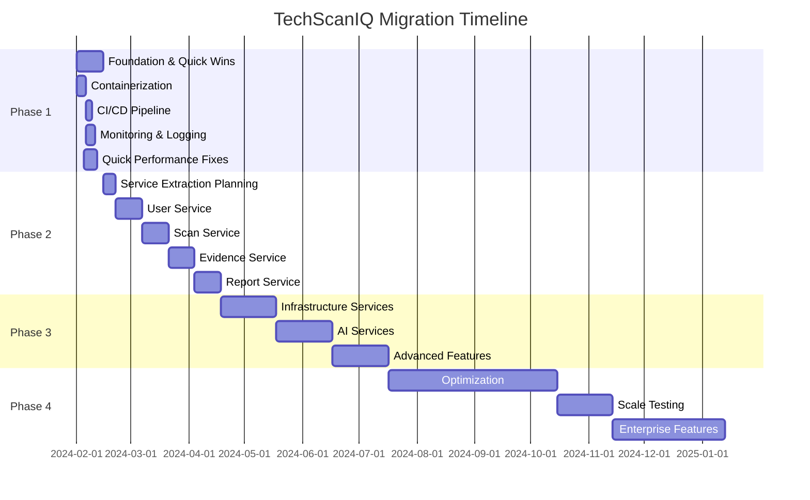
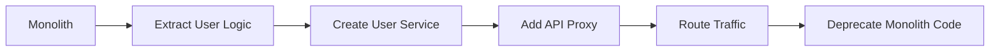

# TechScanIQ Migration Roadmap

## Executive Summary

This document outlines the detailed migration plan from the current monolithic architecture to a microservices-based platform. The migration follows a phased approach designed to minimize risk while delivering incremental value.

## Migration Principles

1. **No Big Bang**: Gradual migration using strangler fig pattern
2. **Business Continuity**: Zero downtime during migration
3. **Incremental Value**: Each phase delivers tangible improvements
4. **Rollback Ready**: Every change can be reverted quickly
5. **Data Integrity**: No data loss during migration

## Phase Overview



## Phase 1: Foundation & Quick Wins (2-4 weeks)

### Week 1-2: Infrastructure Preparation

#### 1.1 Containerization
```yaml
Tasks:
  - Create Dockerfile for API server
  - Create Dockerfile for each worker type
  - Optimize images for size and security
  - Set up multi-stage builds
  - Create docker-compose for local development

Deliverables:
  - Dockerfile.api
  - Dockerfile.worker
  - docker-compose.yml
  - docker-compose.dev.yml

Success Criteria:
  - All components run in containers
  - Images < 200MB
  - Local development workflow maintained
```

#### 1.2 CI/CD Pipeline
```yaml
Tasks:
  - Set up GitHub Actions workflows
  - Implement automated testing
  - Container image building
  - Security scanning (Trivy)
  - Automated deployment to staging

Deliverables:
  - .github/workflows/ci.yml
  - .github/workflows/cd.yml
  - .github/workflows/security.yml

Success Criteria:
  - PR checks < 10 minutes
  - Automated deployment working
  - Security scanning enabled
```

#### 1.3 Monitoring & Observability
```yaml
Tasks:
  - Deploy Prometheus
  - Set up Grafana dashboards
  - Implement structured logging
  - Add health check endpoints
  - Create alert rules

Deliverables:
  - Monitoring stack deployed
  - Application dashboards
  - Alert configurations
  - Runbooks for alerts

Success Criteria:
  - All services monitored
  - P99 latency visible
  - Error rates tracked
  - Alerts configured
```

### Week 3-4: Quick Performance Wins

#### 1.4 Database Optimization
```typescript
// Connection pooling configuration
const poolConfig = {
  max: 20,
  min: 5,
  acquireTimeoutMillis: 30000,
  createTimeoutMillis: 30000,
  destroyTimeoutMillis: 5000,
  idleTimeoutMillis: 30000,
  reapIntervalMillis: 1000,
  createRetryIntervalMillis: 100,
}

// Implement query optimization
const optimizedQueries = {
  // Add indexes
  createIndexes: `
    CREATE INDEX idx_scan_requests_status ON scan_requests(status);
    CREATE INDEX idx_evidence_items_scan_id ON evidence_items(scan_request_id);
    CREATE INDEX idx_reports_scan_id ON reports(scan_request_id);
  `,
  
  // Optimize common queries
  getScanWithEvidence: `
    SELECT s.*, 
           json_agg(e.*) as evidence_items
    FROM scan_requests s
    LEFT JOIN evidence_items e ON e.scan_request_id = s.id
    WHERE s.id = $1
    GROUP BY s.id
  `
}
```

#### 1.5 Memory Leak Fixes
```typescript
// Fix worker memory leaks
class ImprovedWorker {
  private cleanupInterval: NodeJS.Timer;
  
  constructor() {
    // Regular cleanup
    this.cleanupInterval = setInterval(() => {
      this.cleanupOldData();
      if (global.gc) global.gc();
    }, 60000); // Every minute
  }
  
  private cleanupOldData() {
    // Clear old evidence from memory
    this.evidenceCache.clear();
    // Reset accumulated state
    this.discoveredUrls.clear();
  }
  
  async shutdown() {
    clearInterval(this.cleanupInterval);
    // Proper cleanup
    await this.closeConnections();
  }
}
```

#### 1.6 API Performance
```typescript
// Add caching layer
import { createCache } from '@/lib/cache';

const cache = createCache({
  ttl: 300, // 5 minutes
  max: 1000, // Max items
});

// Implement request batching
class BatchProcessor {
  private queue: Request[] = [];
  private timer: NodeJS.Timer;
  
  async add(request: Request) {
    this.queue.push(request);
    
    if (this.queue.length >= 10) {
      await this.process();
    } else if (!this.timer) {
      this.timer = setTimeout(() => this.process(), 100);
    }
  }
  
  private async process() {
    const batch = this.queue.splice(0, 10);
    await this.processBatch(batch);
  }
}
```

### Phase 1 Checklist

- [ ] All components containerized
- [ ] CI/CD pipeline operational
- [ ] Monitoring dashboards live
- [ ] Database connection pooling
- [ ] Memory leaks fixed
- [ ] API response caching
- [ ] Health checks implemented
- [ ] Structured logging
- [ ] Error tracking (Sentry)
- [ ] Performance baseline established

## Phase 2: Service Extraction (6-8 weeks)

### Week 1-2: User Service Extraction

#### 2.1 User Service Design
```yaml
Service: user-service
Port: 3010
Database: Shared (with RLS)

API Endpoints:
  - POST /auth/login
  - POST /auth/logout
  - POST /auth/refresh
  - GET /users/profile
  - PUT /users/profile
  - POST /users/register
  - GET /users/:id (admin only)

Events Published:
  - user.created
  - user.updated
  - user.login
  - user.logout

Dependencies:
  - PostgreSQL (Supabase)
  - Redis (sessions)
```

#### 2.2 Implementation Steps


### Week 3-4: Scan Service Extraction

#### 2.3 Scan Service Design
```yaml
Service: scan-service
Port: 3011
Database: Shared (with RLS)

API Endpoints:
  - POST /scans
  - GET /scans/:id
  - GET /scans
  - PUT /scans/:id
  - POST /scans/:id/retry
  - DELETE /scans/:id

Events Published:
  - scan.created
  - scan.started
  - scan.completed
  - scan.failed
  - scan.retried

Dependencies:
  - PostgreSQL
  - Redis (queues)
  - Event Bus
```

### Week 5-6: Evidence Service Extraction

#### 2.4 Evidence Service Design
```yaml
Service: evidence-service
Port: 3012
Database: Shared (with RLS)

API Endpoints:
  - POST /evidence/collect
  - GET /evidence/:scanId
  - POST /evidence/validate
  - GET /evidence/:id

Events Published:
  - evidence.collected
  - evidence.validated
  - evidence.enriched

Workers:
  - Evidence Collector (Jina)
  - Evidence Collector (Deep)
  - Evidence Validator
```

### Week 7-8: Report Service Extraction

#### 2.5 Report Service Design
```yaml
Service: report-service
Port: 3013
Database: Shared (with RLS)

API Endpoints:
  - POST /reports/generate
  - GET /reports/:id
  - PUT /reports/:id
  - GET /reports
  - POST /reports/:id/export

Events Published:
  - report.generated
  - report.updated
  - report.exported

Workers:
  - Report Generator
  - LangGraph Processor
  - Export Handler
```

### Phase 2 Checklist

- [ ] User Service extracted and deployed
- [ ] Scan Service extracted and deployed
- [ ] Evidence Service extracted and deployed
- [ ] Report Service extracted and deployed
- [ ] API Gateway routing configured
- [ ] Event bus integrated
- [ ] Service discovery working
- [ ] Monitoring for all services
- [ ] Load testing completed
- [ ] Rollback procedures tested

## Phase 3: Full Microservices (3-4 months)

### Month 1: Infrastructure Services

#### 3.1 Event Bus Deployment
```yaml
Kafka Deployment:
  Clusters:
    - Development: 1 broker
    - Staging: 3 brokers
    - Production: 5 brokers
  
  Topics:
    - scan-events
    - evidence-events
    - report-events
    - user-events
    - system-events
  
  Configuration:
    - Replication factor: 3
    - Min in-sync replicas: 2
    - Retention: 7 days
```

#### 3.2 API Gateway Setup
```nginx
# Kong configuration
services:
  - name: user-service
    url: http://user-service:3010
    routes:
      - paths: ["/api/auth", "/api/users"]
        
  - name: scan-service
    url: http://scan-service:3011
    routes:
      - paths: ["/api/scans"]
        
  - name: evidence-service
    url: http://evidence-service:3012
    routes:
      - paths: ["/api/evidence"]
        
  - name: report-service
    url: http://report-service:3013
    routes:
      - paths: ["/api/reports"]

plugins:
  - name: rate-limiting
    config:
      minute: 60
      hour: 1000
      
  - name: jwt
    config:
      key_claim_name: kid
      
  - name: cors
    config:
      origins: ["*"]
      methods: ["GET", "POST", "PUT", "DELETE"]
```

### Month 2: AI Services

#### 3.3 AI Orchestrator Service
```typescript
// AI Orchestrator Design
interface AIOrchestrator {
  // Model routing
  route(request: AIRequest): Promise<AIResponse>;
  
  // Rate limiting
  checkRateLimit(model: string): boolean;
  
  // Cost tracking
  trackCost(model: string, tokens: number): void;
  
  // Fallback handling
  handleFallback(error: Error, request: AIRequest): Promise<AIResponse>;
}

// Model configuration
const modelConfig = {
  primary: {
    model: 'claude-3-opus',
    maxTokens: 100000,
    temperature: 0.7,
  },
  fallback: {
    model: 'gpt-4-turbo',
    maxTokens: 128000,
    temperature: 0.7,
  },
  fast: {
    model: 'gemini-2.0-flash',
    maxTokens: 50000,
    temperature: 0.5,
  }
}
```

#### 3.4 LangGraph Service
```yaml
Service: langgraph-service
Port: 3014

Workflows:
  - Evidence Collection
  - Report Generation
  - Thesis Analysis
  - Deep Research

Features:
  - Workflow versioning
  - State persistence
  - Checkpointing
  - Parallel execution
```

### Month 3: Advanced Features

#### 3.5 Real-time Updates
```typescript
// WebSocket service
class RealtimeService {
  private io: Server;
  
  constructor() {
    this.io = new Server({
      cors: {
        origin: process.env.FRONTEND_URL,
        credentials: true
      }
    });
    
    this.setupEventHandlers();
  }
  
  private setupEventHandlers() {
    // Listen to Kafka events
    kafka.consumer.on('scan.updated', (event) => {
      this.io.to(`scan:${event.scanId}`).emit('scan:update', event);
    });
    
    kafka.consumer.on('evidence.collected', (event) => {
      this.io.to(`scan:${event.scanId}`).emit('evidence:new', event);
    });
  }
}
```

#### 3.6 Workflow Engine
```yaml
Temporal Deployment:
  Components:
    - Temporal Server
    - Worker Nodes
    - Web UI
    
  Workflows:
    - ScanWorkflow
    - EvidenceWorkflow
    - ReportWorkflow
    - AIWorkflow
    
  Activities:
    - CollectEvidence
    - ValidateData
    - GenerateReport
    - SendNotification
```

### Phase 3 Checklist

- [ ] Kafka cluster deployed
- [ ] API Gateway operational
- [ ] Service mesh configured
- [ ] AI Orchestrator deployed
- [ ] LangGraph service running
- [ ] WebSocket service live
- [ ] Workflow engine integrated
- [ ] All services on Kubernetes
- [ ] Auto-scaling configured
- [ ] Disaster recovery tested

## Phase 4: Optimization & Scale (Ongoing)

### Quarter 1: Performance Optimization

#### 4.1 Database Optimization
```sql
-- Partitioning for large tables
CREATE TABLE evidence_items_2024_q1 PARTITION OF evidence_items
FOR VALUES FROM ('2024-01-01') TO ('2024-04-01');

-- Materialized views for reports
CREATE MATERIALIZED VIEW report_summary AS
SELECT 
  s.id,
  s.target_url,
  COUNT(e.id) as evidence_count,
  MAX(r.created_at) as last_report_date
FROM scan_requests s
LEFT JOIN evidence_items e ON e.scan_request_id = s.id
LEFT JOIN reports r ON r.scan_request_id = s.id
GROUP BY s.id;

-- Optimize indexes
CREATE INDEX CONCURRENTLY idx_evidence_created_at 
ON evidence_items(created_at) 
WHERE status = 'completed';
```

#### 4.2 Caching Strategy
```typescript
// Multi-level caching
class CacheManager {
  private l1Cache: Map<string, any>; // In-memory
  private l2Cache: Redis;            // Redis
  private l3Cache: S3;              // S3 for large objects
  
  async get(key: string): Promise<any> {
    // Check L1
    if (this.l1Cache.has(key)) {
      return this.l1Cache.get(key);
    }
    
    // Check L2
    const l2Value = await this.l2Cache.get(key);
    if (l2Value) {
      this.l1Cache.set(key, l2Value);
      return l2Value;
    }
    
    // Check L3
    const l3Value = await this.l3Cache.getObject(key);
    if (l3Value) {
      await this.l2Cache.set(key, l3Value, 'EX', 3600);
      this.l1Cache.set(key, l3Value);
      return l3Value;
    }
    
    return null;
  }
}
```

### Quarter 2: Enterprise Features

#### 4.3 Multi-region Deployment
```yaml
Regions:
  Primary: us-east-1
  Secondary: eu-west-1
  Tertiary: ap-southeast-1

Architecture:
  - Active-Active for API
  - Primary-Secondary for Database
  - Regional S3 buckets
  - Global CDN

Data Replication:
  - PostgreSQL streaming replication
  - S3 cross-region replication
  - Redis replication
```

#### 4.4 Enhanced Security
```typescript
// Security enhancements
class SecurityManager {
  // API key rotation
  async rotateApiKeys() {
    const newKeys = await this.generateNewKeys();
    await this.distributeKeys(newKeys);
    await this.scheduleOldKeyDeletion();
  }
  
  // Encryption at rest
  async encryptData(data: any): Promise<string> {
    const key = await this.kms.generateDataKey();
    return this.encrypt(data, key);
  }
  
  // Audit logging
  async logAccess(event: AccessEvent) {
    await this.auditLog.write({
      ...event,
      timestamp: new Date(),
      ip: event.request.ip,
      userAgent: event.request.userAgent,
    });
  }
}
```

### Quarter 3: Advanced Analytics

#### 4.5 Analytics Pipeline
```yaml
Data Pipeline:
  Sources:
    - Application events
    - User interactions
    - System metrics
    
  Processing:
    - Apache Spark for batch
    - Kafka Streams for real-time
    - ML models for insights
    
  Storage:
    - Data Lake (S3)
    - Data Warehouse (Redshift)
    - Time Series (InfluxDB)
    
  Visualization:
    - Business dashboards
    - Technical metrics
    - Custom reports
```

## Migration Risks & Mitigations

### Technical Risks

| Risk | Probability | Impact | Mitigation |
|------|-------------|--------|------------|
| Data loss during migration | Low | High | Comprehensive backups, dry runs |
| Service communication failures | Medium | High | Circuit breakers, retries, fallbacks |
| Performance degradation | Medium | Medium | Load testing, gradual rollout |
| Security vulnerabilities | Low | High | Security scanning, penetration testing |
| Operational complexity | High | Medium | Training, documentation, runbooks |

### Business Risks

| Risk | Probability | Impact | Mitigation |
|------|-------------|--------|------------|
| Feature parity issues | Medium | High | Comprehensive testing, user acceptance |
| Customer disruption | Low | High | Blue-green deployments, communication |
| Cost overruns | Medium | Medium | Regular reviews, cost monitoring |
| Timeline delays | Medium | Medium | Agile approach, buffer time |
| Team burnout | Medium | Medium | Realistic planning, additional resources |

## Success Metrics

### Phase 1 Success Criteria
- Deployment time reduced by 50%
- Memory usage reduced by 30%
- API response time < 500ms (P95)
- Zero security vulnerabilities

### Phase 2 Success Criteria
- All core services extracted
- 99.9% uptime maintained
- No data consistency issues
- Rollback tested successfully

### Phase 3 Success Criteria
- Full microservices deployed
- Auto-scaling operational
- Event-driven architecture working
- Real-time updates functional

### Phase 4 Success Criteria
- 100x traffic handling capability
- Multi-region deployment
- Enterprise features complete
- Advanced analytics operational

## Communication Plan

### Stakeholder Updates
- Weekly progress reports
- Monthly steering committee
- Quarterly board updates
- Ad-hoc issue escalation

### Team Communication
- Daily standups
- Weekly architecture reviews
- Sprint retrospectives
- Technical documentation

### Customer Communication
- Migration announcements
- Feature parity updates
- Performance improvements
- New capability releases

## Conclusion

This migration roadmap provides a structured approach to transforming TechScanIQ from a monolithic application to a scalable microservices platform. The phased approach minimizes risk while delivering continuous value. Success depends on:

1. Strong technical execution
2. Clear communication
3. Comprehensive testing
4. Team collaboration
5. Stakeholder alignment

With proper execution, TechScanIQ will emerge as a robust, scalable platform ready for significant growth.