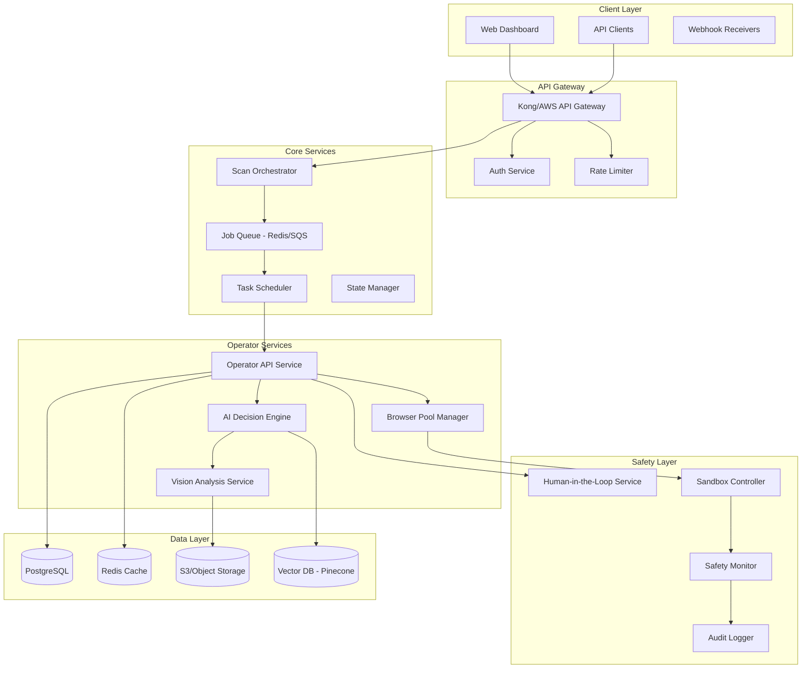

# TechScanIQ Operator Tool Architecture Design

## Executive Summary

This document outlines the comprehensive technical architecture for integrating operator tools into TechScanIQ, enabling dynamic evidence gathering and autonomous UX analysis capabilities.

## 1. System Architecture Overview

### 1.1 Architecture Pattern: Hybrid Microservices

```yaml
Architecture Choice: Hybrid Microservices
Reasoning:
  - Core TechScanIQ remains monolithic for simplicity
  - Operator services isolated as microservices
  - Enables independent scaling of browser instances
  - Fault isolation for operator failures
  - Technology flexibility per service
```

### 1.2 High-Level Architecture



### 1.3 Component Responsibilities

#### Scan Orchestrator
- Receives scan requests
- Determines if operator tools needed
- Creates job specifications
- Manages scan lifecycle

#### Operator API Service
- Exposes operator capabilities
- Translates natural language to actions
- Manages browser sessions
- Coordinates with AI services

#### Browser Pool Manager
- Maintains warm browser instances
- Handles instance lifecycle
- Implements resource limits
- Manages concurrent executions

#### AI Decision Engine
- Interprets task instructions
- Plans action sequences
- Makes navigation decisions
- Handles dynamic content

#### Vision Analysis Service
- Screenshot analysis
- Element detection
- OCR capabilities
- Visual regression detection

## 2. Queue-Based Job Processing

### 2.1 Job Queue Architecture

```typescript
interface OperatorJob {
  id: string;
  type: 'ux_audit' | 'evidence_gathering' | 'journey_mapping' | 'accessibility';
  priority: 'low' | 'normal' | 'high' | 'critical';
  payload: {
    url: string;
    tasks: OperatorTask[];
    config: OperatorConfig;
    constraints: SafetyConstraints;
  };
  metadata: {
    scanId: string;
    userId: string;
    organizationId: string;
    createdAt: Date;
    estimatedDuration: number;
    estimatedCost: number;
  };
  status: JobStatus;
  retries: number;
  results?: OperatorResults;
}

interface OperatorTask {
  id: string;
  description: string;
  type: 'navigate' | 'interact' | 'extract' | 'analyze' | 'validate';
  selectors?: string[];
  expectedOutcome?: string;
  fallbackStrategy?: string;
  humanApprovalRequired?: boolean;
}

// Queue implementation using Bull/Redis
import Bull from 'bull';

const operatorQueue = new Bull('operator-jobs', {
  redis: {
    host: process.env.REDIS_HOST,
    port: process.env.REDIS_PORT,
    password: process.env.REDIS_PASSWORD,
  },
  defaultJobOptions: {
    removeOnComplete: false,
    removeOnFail: false,
    attempts: 3,
    backoff: {
      type: 'exponential',
      delay: 5000,
    },
  },
});

// Priority-based processing
operatorQueue.process('critical', 5, processOperatorJob);
operatorQueue.process('high', 3, processOperatorJob);
operatorQueue.process('normal', 2, processOperatorJob);
operatorQueue.process('low', 1, processOperatorJob);
```

### 2.2 Job Lifecycle Management

```typescript
class OperatorJobManager {
  async createJob(request: ScanRequest): Promise<OperatorJob> {
    // Validate request
    const validation = await this.validateRequest(request);
    if (!validation.isValid) {
      throw new ValidationError(validation.errors);
    }
    
    // Estimate resources
    const estimation = await this.estimateResources(request);
    
    // Check quotas
    const quotaCheck = await this.checkQuotas(
      request.userId,
      estimation
    );
    if (!quotaCheck.allowed) {
      throw new QuotaExceededError(quotaCheck.reason);
    }
    
    // Create job
    const job: OperatorJob = {
      id: generateId(),
      type: request.scanType,
      priority: this.calculatePriority(request),
      payload: {
        url: request.url,
        tasks: this.generateTasks(request),
        config: this.buildConfig(request),
        constraints: this.defineSafetyConstraints(request),
      },
      metadata: {
        scanId: request.scanId,
        userId: request.userId,
        organizationId: request.organizationId,
        createdAt: new Date(),
        estimatedDuration: estimation.duration,
        estimatedCost: estimation.cost,
      },
      status: 'pending',
      retries: 0,
    };
    
    // Queue job
    await operatorQueue.add(job.type, job, {
      priority: this.getPriorityValue(job.priority),
      delay: request.scheduledFor ? 
        new Date(request.scheduledFor).getTime() - Date.now() : 0,
    });
    
    return job;
  }
  
  private calculatePriority(request: ScanRequest): JobPriority {
    // Premium users get higher priority
    if (request.userTier === 'premium') return 'high';
    if (request.userTier === 'enterprise') return 'critical';
    
    // Time-sensitive scans
    if (request.urgent) return 'high';
    
    // Default priority
    return 'normal';
  }
}
```

## 3. Scalability Patterns

### 3.1 Browser Instance Pool

```typescript
class BrowserPoolManager {
  private pools: Map<string, BrowserPool> = new Map();
  private metrics: PoolMetrics;
  
  constructor(private config: PoolConfig) {
    this.initializePools();
    this.startMetricsCollection();
  }
  
  private initializePools() {
    // Create separate pools for different workload types
    this.pools.set('lightweight', new BrowserPool({
      min: 5,
      max: 50,
      idleTimeout: 300000, // 5 minutes
      browserOptions: {
        headless: true,
        args: ['--no-sandbox', '--disable-gpu'],
      },
    }));
    
    this.pools.set('heavyweight', new BrowserPool({
      min: 2,
      max: 20,
      idleTimeout: 600000, // 10 minutes
      browserOptions: {
        headless: false, // For complex interactions
        args: ['--no-sandbox'],
      },
    }));
    
    this.pools.set('stealth', new BrowserPool({
      min: 1,
      max: 10,
      idleTimeout: 900000, // 15 minutes
      browserOptions: {
        headless: false,
        args: ['--disable-blink-features=AutomationControlled'],
        // Additional stealth plugins
      },
    }));
  }
  
  async acquireBrowser(
    type: 'lightweight' | 'heavyweight' | 'stealth'
  ): Promise<BrowserInstance> {
    const pool = this.pools.get(type);
    if (!pool) throw new Error(`Unknown pool type: ${type}`);
    
    // Check pool health
    const health = await pool.checkHealth();
    if (!health.healthy) {
      await pool.restart();
    }
    
    // Acquire instance with timeout
    const instance = await pool.acquire({
      timeout: 30000,
      priority: 'normal',
    });
    
    // Wrap with monitoring
    return new MonitoredBrowserInstance(instance, this.metrics);
  }
  
  async getPoolStats(): Promise<PoolStats> {
    const stats: PoolStats = {
      pools: {},
      totalActive: 0,
      totalIdle: 0,
      totalCreated: 0,
      totalDestroyed: 0,
    };
    
    for (const [name, pool] of this.pools) {
      const poolStats = await pool.getStats();
      stats.pools[name] = poolStats;
      stats.totalActive += poolStats.active;
      stats.totalIdle += poolStats.idle;
      stats.totalCreated += poolStats.created;
      stats.totalDestroyed += poolStats.destroyed;
    }
    
    return stats;
  }
}
```

### 3.2 Horizontal Scaling Strategy

```yaml
# Kubernetes Deployment for Operator Services
apiVersion: apps/v1
kind: Deployment
metadata:
  name: operator-service
spec:
  replicas: 3
  selector:
    matchLabels:
      app: operator-service
  template:
    metadata:
      labels:
        app: operator-service
    spec:
      containers:
      - name: operator
        image: techscaniq/operator-service:latest
        resources:
          requests:
            memory: "2Gi"
            cpu: "1"
          limits:
            memory: "4Gi"
            cpu: "2"
        env:
        - name: MAX_BROWSERS_PER_INSTANCE
          value: "10"
        - name: BROWSER_IDLE_TIMEOUT
          value: "300000"
---
apiVersion: autoscaling/v2
kind: HorizontalPodAutoscaler
metadata:
  name: operator-service-hpa
spec:
  scaleTargetRef:
    apiVersion: apps/v1
    kind: Deployment
    name: operator-service
  minReplicas: 3
  maxReplicas: 50
  metrics:
  - type: Resource
    resource:
      name: cpu
      target:
        type: Utilization
        averageUtilization: 70
  - type: Resource
    resource:
      name: memory
      target:
        type: Utilization
        averageUtilization: 80
  - type: Pods
    pods:
      metric:
        name: active_browsers
      target:
        type: AverageValue
        averageValue: "8"
```

## 4. Database Schema

```sql
-- Operator job tracking
CREATE TABLE operator_jobs (
    id UUID PRIMARY KEY DEFAULT gen_random_uuid(),
    scan_id UUID REFERENCES scans(id),
    type VARCHAR(50) NOT NULL,
    priority VARCHAR(20) NOT NULL,
    status VARCHAR(50) NOT NULL,
    created_at TIMESTAMP WITH TIME ZONE DEFAULT CURRENT_TIMESTAMP,
    started_at TIMESTAMP WITH TIME ZONE,
    completed_at TIMESTAMP WITH TIME ZONE,
    estimated_duration INTEGER,
    actual_duration INTEGER,
    estimated_cost DECIMAL(10, 4),
    actual_cost DECIMAL(10, 4),
    retry_count INTEGER DEFAULT 0,
    error_message TEXT,
    payload JSONB NOT NULL,
    results JSONB,
    metadata JSONB
);

-- Operator actions log
CREATE TABLE operator_actions (
    id UUID PRIMARY KEY DEFAULT gen_random_uuid(),
    job_id UUID REFERENCES operator_jobs(id),
    sequence_number INTEGER NOT NULL,
    action_type VARCHAR(50) NOT NULL,
    description TEXT,
    started_at TIMESTAMP WITH TIME ZONE DEFAULT CURRENT_TIMESTAMP,
    completed_at TIMESTAMP WITH TIME ZONE,
    duration_ms INTEGER,
    success BOOLEAN,
    screenshot_url TEXT,
    element_selector TEXT,
    input_data JSONB,
    output_data JSONB,
    error_details JSONB,
    ai_confidence DECIMAL(3, 2),
    human_verified BOOLEAN DEFAULT FALSE
);

-- Human intervention requests
CREATE TABLE operator_interventions (
    id UUID PRIMARY KEY DEFAULT gen_random_uuid(),
    job_id UUID REFERENCES operator_jobs(id),
    action_id UUID REFERENCES operator_actions(id),
    reason VARCHAR(200) NOT NULL,
    context JSONB NOT NULL,
    options JSONB NOT NULL,
    requested_at TIMESTAMP WITH TIME ZONE DEFAULT CURRENT_TIMESTAMP,
    responded_at TIMESTAMP WITH TIME ZONE,
    response_time_ms INTEGER,
    decision VARCHAR(100),
    decision_details JSONB,
    decided_by VARCHAR(255)
);

-- Browser pool metrics
CREATE TABLE browser_pool_metrics (
    id UUID PRIMARY KEY DEFAULT gen_random_uuid(),
    timestamp TIMESTAMP WITH TIME ZONE DEFAULT CURRENT_TIMESTAMP,
    pool_name VARCHAR(50) NOT NULL,
    active_count INTEGER NOT NULL,
    idle_count INTEGER NOT NULL,
    queue_length INTEGER NOT NULL,
    avg_acquisition_time_ms INTEGER,
    error_count INTEGER,
    memory_usage_mb INTEGER,
    cpu_usage_percent DECIMAL(5, 2)
);

-- Safety violations log
CREATE TABLE operator_safety_violations (
    id UUID PRIMARY KEY DEFAULT gen_random_uuid(),
    job_id UUID REFERENCES operator_jobs(id),
    action_id UUID REFERENCES operator_actions(id),
    violation_type VARCHAR(100) NOT NULL,
    severity VARCHAR(20) NOT NULL,
    description TEXT NOT NULL,
    detected_at TIMESTAMP WITH TIME ZONE DEFAULT CURRENT_TIMESTAMP,
    prevented BOOLEAN NOT NULL,
    context JSONB,
    remediation_applied TEXT
);

-- Create indexes for performance
CREATE INDEX idx_operator_jobs_scan_id ON operator_jobs(scan_id);
CREATE INDEX idx_operator_jobs_status ON operator_jobs(status);
CREATE INDEX idx_operator_jobs_created_at ON operator_jobs(created_at);
CREATE INDEX idx_operator_actions_job_id ON operator_actions(job_id);
CREATE INDEX idx_operator_actions_started_at ON operator_actions(started_at);
CREATE INDEX idx_operator_interventions_job_id ON operator_interventions(job_id);
CREATE INDEX idx_operator_interventions_requested_at ON operator_interventions(requested_at);
CREATE INDEX idx_browser_pool_metrics_timestamp ON browser_pool_metrics(timestamp);
CREATE INDEX idx_operator_safety_violations_job_id ON operator_safety_violations(job_id);
CREATE INDEX idx_operator_safety_violations_detected_at ON operator_safety_violations(detected_at);
```

## 5. Technology Stack Recommendations

### 5.1 Core Technologies

```yaml
Backend Services:
  Language: TypeScript/Node.js
  Framework: NestJS (for microservices)
  API: GraphQL with Apollo Server
  Queue: Bull (Redis-based)
  Cache: Redis
  Database: PostgreSQL with TimescaleDB extension
  
Browser Automation:
  Primary: Playwright
  Secondary: Puppeteer (for specific use cases)
  Stealth: puppeteer-extra-plugin-stealth
  
AI/ML Stack:
  Vision: GPT-4V API
  Embeddings: OpenAI Ada-002
  Vector DB: Pinecone
  Local Models: ONNX Runtime
  
Infrastructure:
  Container: Docker
  Orchestration: Kubernetes (EKS/GKE)
  Service Mesh: Istio
  Monitoring: Prometheus + Grafana
  Logging: ELK Stack
  Tracing: Jaeger
  
Security:
  Secrets: HashiCorp Vault
  Network: Calico
  Runtime: gVisor
  Scanning: Trivy
```

### 5.2 Development Tools

```yaml
Development:
  IDE: VS Code with recommended extensions
  Linting: ESLint + Prettier
  Testing: Jest + Playwright Test
  API Testing: Postman/Insomnia
  
CI/CD:
  Pipeline: GitHub Actions
  Container Registry: ECR/GCR
  Deployment: ArgoCD
  Feature Flags: LaunchDarkly
  
Monitoring:
  APM: DataDog / New Relic
  Error Tracking: Sentry
  Uptime: PagerDuty
  Analytics: Mixpanel
```

## 6. Implementation Phases

### Phase 1: Foundation (Months 1-2)
- Basic operator service setup
- Simple browser pool implementation
- PostgreSQL schema deployment
- Basic safety checks
- Manual testing interface

### Phase 2: Intelligence (Months 3-4)
- AI integration for decision making
- Vision analysis capabilities
- Advanced element detection
- Pattern learning system
- Automated task generation

### Phase 3: Scale (Months 5-6)
- Kubernetes deployment
- Auto-scaling implementation
- Performance optimization
- Cost optimization
- Enterprise features

### Phase 4: Advanced Features (Months 7-8)
- Complex multi-step workflows
- Advanced HITL system
- ML-based optimization
- Custom operator tools
- White-label capabilities

## Next Steps

1. Review and approve architecture
2. Set up development environment
3. Implement Phase 1 MVP
4. Conduct security review
5. Performance testing
6. Beta customer trials