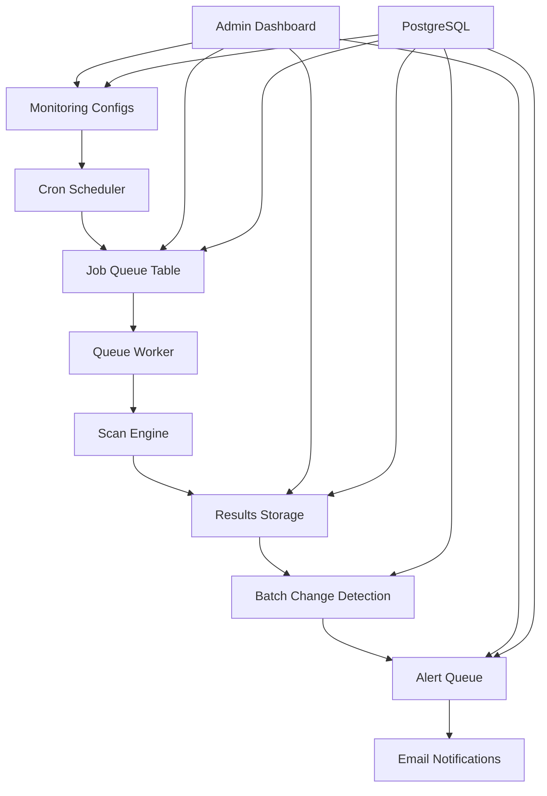

# Queue-Based Monitoring System - Work Document

## Executive Summary

This document outlines the implementation of a **queue-based monitoring system** for TechScanIQ, replacing the original real-time proposal with a simpler, more cost-effective approach that aligns with the stated requirement: "real time isn't a concern because our use case doesn't matter for doing anything real time."

## Background & Requirements

### Original Problem
- Need to monitor competitor websites for technology changes
- Track performance metrics and infrastructure changes
- Alert stakeholders when significant changes are detected
- Support multiple organizations with different monitoring needs

### User Requirements (Key Constraints)
- ✅ **Queue-based processing** preferred over real-time
- ✅ **Cost-effective** - avoid enterprise streaming infrastructure 
- ✅ **Simple maintenance** - manageable by small team
- ❌ **No real-time requirements** - batch processing is sufficient

### Revised Approach
Instead of Kafka streams and real-time dashboards, implement:
- **Cron-based scheduling** for periodic scans
- **PostgreSQL job queues** for reliable processing
- **Batch change detection** every 15-30 minutes
- **Email digest notifications** instead of instant alerts

## System Architecture



## Database Schema

### Core Tables

```sql
-- Monitoring configurations
CREATE TABLE monitoring_configs (
    id UUID PRIMARY KEY DEFAULT gen_random_uuid(),
    organization_id UUID NOT NULL,
    name VARCHAR(255) NOT NULL,
    url VARCHAR(2048) NOT NULL,
    schedule_cron VARCHAR(100) NOT NULL, -- '0 */6 * * *' = every 6 hours
    scan_config JSONB NOT NULL,          -- scan depth, technologies to track
    alert_config JSONB NOT NULL,         -- email recipients, trigger conditions
    enabled BOOLEAN DEFAULT true,
    last_scan_at TIMESTAMPTZ,
    next_scan_at TIMESTAMPTZ,
    created_at TIMESTAMPTZ DEFAULT NOW()
);

-- Simple job queue
CREATE TABLE scan_jobs (
    id UUID PRIMARY KEY DEFAULT gen_random_uuid(),
    config_id UUID REFERENCES monitoring_configs(id),
    status VARCHAR(20) DEFAULT 'pending', -- pending, running, completed, failed
    scheduled_for TIMESTAMPTZ NOT NULL,
    started_at TIMESTAMPTZ,
    completed_at TIMESTAMPTZ,
    result JSONB,
    error_message TEXT,
    created_at TIMESTAMPTZ DEFAULT NOW()
);

-- Scan results storage
CREATE TABLE scan_results (
    id UUID PRIMARY KEY DEFAULT gen_random_uuid(),
    job_id UUID REFERENCES scan_jobs(id),
    config_id UUID REFERENCES monitoring_configs(id),
    scanned_at TIMESTAMPTZ NOT NULL,
    result_summary JSONB NOT NULL,       -- key metrics, technologies found
    full_result_url VARCHAR(2048),       -- S3/R2 link for complete data
    processing_time_ms INTEGER,
    created_at TIMESTAMPTZ DEFAULT NOW()
);

-- Change detection (batch processed)
CREATE TABLE detected_changes (
    id UUID PRIMARY KEY DEFAULT gen_random_uuid(),
    config_id UUID REFERENCES monitoring_configs(id),
    from_scan_id UUID REFERENCES scan_results(id),
    to_scan_id UUID REFERENCES scan_results(id),
    change_type VARCHAR(100) NOT NULL,   -- technology_added, performance_degraded
    change_data JSONB NOT NULL,
    severity VARCHAR(20) NOT NULL,       -- low, medium, high
    processed_at TIMESTAMPTZ DEFAULT NOW()
);

-- Alert queue (batch notifications)
CREATE TABLE alert_queue (
    id UUID PRIMARY KEY DEFAULT gen_random_uuid(),
    config_id UUID REFERENCES monitoring_configs(id),
    change_id UUID REFERENCES detected_changes(id),
    alert_type VARCHAR(50) NOT NULL,
    recipient_config JSONB NOT NULL,
    message JSONB NOT NULL,
    scheduled_for TIMESTAMPTZ DEFAULT NOW(),
    sent_at TIMESTAMPTZ,
    status VARCHAR(20) DEFAULT 'pending', -- pending, sent, failed
    created_at TIMESTAMPTZ DEFAULT NOW()
);
```

## Implementation Components

### 1. Monitoring Scheduler (`src/services/monitoring-scheduler.ts`)

**Responsibilities:**
- Load active monitoring configs on startup
- Create cron jobs for each monitoring schedule
- Queue scan jobs when schedules trigger
- Manage batch processing schedules (change detection, alerts)

**Key Features:**
- Uses `node-cron` for reliable scheduling
- Updates `next_scan_at` in database for visibility
- Handles job rescheduling when configs change
- Batch processors run every 15-30 minutes

```typescript
class MonitoringScheduler {
  private jobs: Map<string, CronJob> = new Map();
  
  async scheduleMonitoring(config: MonitoringConfig) {
    const job = new CronJob(
      config.schedule_cron,
      () => this.queueScanJob(config),
      null, true, 'UTC'
    );
    this.jobs.set(`monitor_${config.id}`, job);
  }
}
```

### 2. Queue Worker (`src/workers/monitoring-queue-worker.ts`)

**Responsibilities:**
- Poll database for pending scan jobs
- Execute scans using existing scan engine
- Store results and update job status
- Handle failures and retries

**Key Features:**
- Simple polling mechanism (5-second intervals)
- Processes 5 jobs concurrently
- Comprehensive error handling
- Integrates with existing scan infrastructure

```typescript
class MonitoringQueueWorker {
  async processPendingJobs() {
    const jobs = await supabase
      .from('scan_jobs')
      .select('*, monitoring_configs (*)')
      .eq('status', 'pending')
      .limit(5);
    
    for (const job of jobs) {
      await this.processJob(job);
    }
  }
}
```

### 3. Change Detection Service (`src/services/change-detection.ts`)

**Responsibilities:**
- Compare consecutive scan results
- Identify meaningful changes (technology, performance, content)
- Calculate change severity
- Queue alerts based on configuration

**Key Features:**
- Batch processing every 15 minutes
- Configurable change thresholds
- Multiple change types (technology, performance, security)
- Automatic severity classification

```typescript
class ChangeDetectionService {
  private compareScans(oldScan, newScan) {
    const changes = [];
    
    // Technology changes
    const oldTech = new Set(oldScan.technologies);
    const newTech = new Set(newScan.technologies);
    
    // Performance changes (>20% threshold)
    const perfChange = this.calculatePerformanceChange(oldScan, newScan);
    
    return changes;
  }
}
```

### 4. Dashboard (`src/components/MonitoringDashboard.tsx`)

**Responsibilities:**
- Display monitoring status and recent changes
- Allow configuration management
- Show job queue status and historical data
- Provide manual scan triggering

**Key Features:**
- Simple React dashboard (no websockets)
- 30-second auto-refresh
- Configuration CRUD operations
- Change history visualization

## Work Breakdown

### Phase 1: Database & Scheduling (Days 1-2)
1. **Database Schema**: Create all tables with proper indexes
2. **Monitoring Scheduler**: Implement cron-based job scheduling
3. **Basic Admin UI**: Configuration management interface
4. **Testing**: Unit tests for scheduler logic

### Phase 2: Queue Processing (Days 2-3)  
1. **Queue Worker**: Implement job processing worker
2. **Scan Integration**: Connect with existing scan engine
3. **Result Storage**: Store scan results with S3/R2 links
4. **Error Handling**: Comprehensive failure management

### Phase 3: Change Detection (Days 3-4)
1. **Comparison Logic**: Implement scan result comparison
2. **Change Classification**: Categorize and score changes
3. **Alert Queueing**: Queue notifications based on config
4. **Batch Processing**: Process changes every 15 minutes

### Phase 4: Dashboard & Alerts (Days 4-5)
1. **Dashboard Components**: Status overview and management
2. **Email Notifications**: Implement digest-style alerts
3. **Historical Views**: Display change history and trends
4. **Documentation**: User guides and API documentation

## Package.json Integration

**New Scripts** (coordinate with DEV-004):
```json
{
  "worker:monitoring:scheduler": "tsx src/workers/monitoring-scheduler.ts",
  "worker:monitoring:queue": "tsx src/workers/monitoring-queue-worker.ts", 
  "workers:monitoring": "concurrently \"npm run worker:monitoring:scheduler\" \"npm run worker:monitoring:queue\"",
  "dev:monitoring": "concurrently \"npm run worker:backend\" \"npm run api:server\" \"npm run workers:monitoring\""
}
```

## Configuration Examples

### Basic Monitoring Config
```json
{
  "name": "Competitor Tech Stack Monitoring",
  "url": "https://competitor.com",
  "schedule_cron": "0 */6 * * *",
  "scan_config": {
    "depth": "medium",
    "track_technologies": true,
    "track_performance": true,
    "track_security_headers": true
  },
  "alert_config": {
    "enabled": true,
    "triggers": ["technology_added", "technology_removed", "performance_degraded"],
    "recipients": ["team@company.com"],
    "digest_frequency": "daily"
  }
}
```

### Change Detection Example
```json
{
  "change_type": "technology_added",
  "change_data": {
    "technology": "Next.js",
    "version": "14.0.0",
    "confidence": 0.95
  },
  "severity": "medium"
}
```

## Success Metrics

### Technical Success
- ✅ **Reliability**: >99% job completion rate
- ✅ **Performance**: <5 minute average scan completion
- ✅ **Accuracy**: <5% false positive change detection
- ✅ **Scalability**: Support 100+ monitored sites

### Business Success
- ✅ **Cost Efficiency**: <$100/month infrastructure costs
- ✅ **Team Efficiency**: <2 hours/week maintenance
- ✅ **User Satisfaction**: Useful change notifications
- ✅ **Data Quality**: Actionable competitive intelligence

## Deployment Strategy

### Development Environment
1. Local PostgreSQL database
2. Development worker processes
3. Test monitoring configurations
4. Email sandbox for alert testing

### Production Environment  
1. Supabase PostgreSQL (existing)
2. Containerized workers (Docker)
3. S3/R2 storage for scan results
4. Email service (SendGrid/SES)

### Migration Path
1. **Parallel Testing**: Run alongside existing systems
2. **Gradual Rollout**: Start with internal monitoring
3. **User Migration**: Move customers to new system
4. **Legacy Cleanup**: Remove old monitoring code

## Risk Mitigation

### Technical Risks
- **Database Performance**: Proper indexing and connection pooling
- **Worker Failures**: Comprehensive error handling and retries
- **Scan Engine Integration**: Thorough testing with existing code
- **Scale Issues**: Monitoring and horizontal scaling plans

### Business Risks
- **User Adoption**: Clear migration communication
- **Data Loss**: Backup and recovery procedures
- **Service Interruption**: Zero-downtime deployment
- **Cost Overruns**: Budget monitoring and alerts

## Future Enhancements

### Phase 2 Features (Post-MVP)
- **Advanced Analytics**: Trend analysis and predictions
- **API Integrations**: Webhook notifications
- **Custom Scanners**: Industry-specific scan types
- **Team Collaboration**: Shared monitoring and comments

### Potential Integrations
- **Slack/Teams**: Chat notifications
- **Zapier**: Workflow automation
- **BI Tools**: Data visualization
- **CRM Systems**: Competitive intelligence integration

## Conclusion

This queue-based monitoring system provides a **practical, cost-effective solution** that meets the stated requirements while avoiding the complexity of real-time streaming infrastructure. The implementation focuses on:

- **Simplicity**: Easy to understand and maintain
- **Reliability**: Robust job processing with error handling  
- **Flexibility**: Configurable monitoring and alerting
- **Cost-Effectiveness**: Minimal infrastructure requirements

The system can be developed in **parallel with DEV-004** backend integration work, with minimal coordination needed for package.json script management.

## Next Steps

1. **Assign to Data Engineer**: Allocate 4-5 days for implementation
2. **Coordinate with DEV-004**: Ensure package.json changes don't conflict
3. **Database Setup**: Create monitoring tables in development
4. **Begin Phase 1**: Start with database schema and basic scheduling