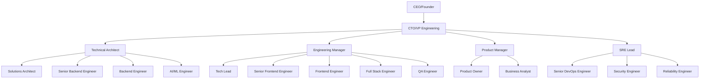
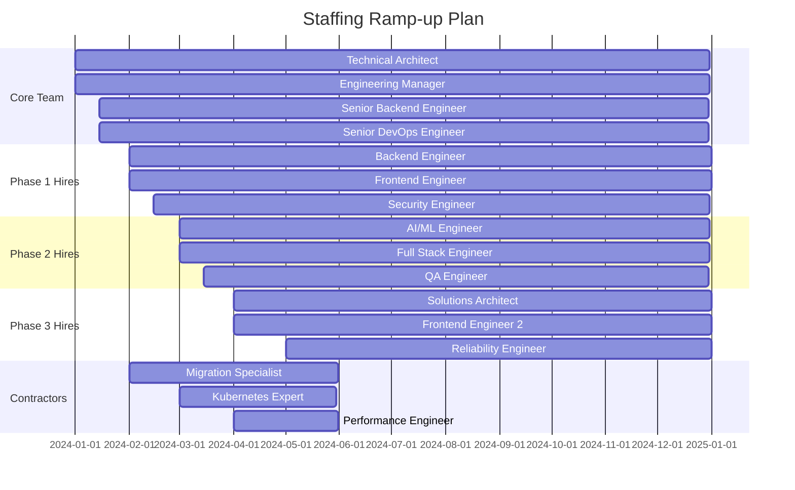

# TechScanIQ Resource Plan and Budget Estimation

## Executive Summary

This document outlines the comprehensive resource requirements for the TechScanIQ migration project, including team structure, infrastructure needs, tooling, training requirements, and detailed budget estimates.

## Team Structure and Staffing Plan

### Organizational Chart



### Staffing Timeline



### Role Definitions and Responsibilities

#### Leadership Roles

**Technical Architect**
- **Salary Range**: $180,000 - $220,000
- **Experience**: 10+ years
- **Responsibilities**:
  - Overall system design
  - Technology decisions
  - Architecture reviews
  - Team mentorship
  - Stakeholder communication

**Engineering Manager**
- **Salary Range**: $160,000 - $200,000
- **Experience**: 8+ years
- **Responsibilities**:
  - Team management
  - Sprint planning
  - Resource allocation
  - Performance reviews
  - Cross-team coordination

#### Engineering Roles

**Senior Backend Engineer**
- **Salary Range**: $150,000 - $180,000
- **Experience**: 7+ years
- **Skills Required**:
  - Microservices architecture
  - Node.js/TypeScript
  - Kubernetes
  - Event-driven systems
  - Database design

**Backend Engineer**
- **Salary Range**: $120,000 - $150,000
- **Experience**: 3-5 years
- **Skills Required**:
  - Node.js/TypeScript
  - REST APIs
  - PostgreSQL
  - Basic Kubernetes
  - Testing

**AI/ML Engineer**
- **Salary Range**: $160,000 - $200,000
- **Experience**: 5+ years
- **Skills Required**:
  - LLM integration
  - Python
  - LangChain/LangGraph
  - Model optimization
  - API development

**Frontend Engineers**
- **Salary Range**: $120,000 - $160,000
- **Experience**: 3-7 years
- **Skills Required**:
  - React/TypeScript
  - State management
  - API integration
  - Responsive design
  - Testing

#### Infrastructure Roles

**Senior DevOps Engineer**
- **Salary Range**: $150,000 - $180,000
- **Experience**: 7+ years
- **Skills Required**:
  - Kubernetes administration
  - CI/CD pipelines
  - Infrastructure as Code
  - Monitoring/Logging
  - Cloud platforms

**Security Engineer**
- **Salary Range**: $140,000 - $170,000
- **Experience**: 5+ years
- **Skills Required**:
  - Application security
  - Cloud security
  - Compliance
  - Penetration testing
  - Security automation

### Contractor Requirements

**Migration Specialist** (6 months)
- **Rate**: $150-200/hour
- **Hours**: 40 hours/week
- **Total Cost**: $156,000 - $208,000

**Kubernetes Expert** (3 months)
- **Rate**: $175-225/hour
- **Hours**: 30 hours/week
- **Total Cost**: $68,250 - $87,750

**Performance Engineer** (2 months)
- **Rate**: $150-180/hour
- **Hours**: 40 hours/week
- **Total Cost**: $52,000 - $62,400

## Infrastructure Requirements

### Development Environment

```yaml
Kubernetes Cluster (Dev):
  Control Plane:
    - 3 x t3.medium (2 vCPU, 4GB RAM)
    - Cost: $0.0416/hour x 3 = $90/month
  
  Worker Nodes:
    - 3 x t3.large (2 vCPU, 8GB RAM)
    - Cost: $0.0832/hour x 3 = $180/month
  
  Total: $270/month

Databases (Dev):
  PostgreSQL:
    - db.t3.medium (2 vCPU, 4GB RAM)
    - Cost: $0.068/hour = $49/month
  
  Redis:
    - cache.t3.small (2 vCPU, 2GB RAM)
    - Cost: $0.034/hour = $24/month
  
  Total: $73/month

Storage (Dev):
  S3:
    - 100GB storage
    - 1TB transfer
    - Cost: $25/month
  
  Container Registry:
    - 50GB storage
    - Cost: $5/month
  
  Total: $30/month

Development Tools:
  - GitHub Enterprise: $21/user/month x 15 = $315/month
  - Jira/Confluence: $7/user/month x 15 = $105/month
  - Slack: $8/user/month x 15 = $120/month
  - Total: $540/month

Total Development Environment: $913/month
```

### Staging Environment

```yaml
Kubernetes Cluster (Staging):
  Control Plane:
    - 3 x t3.large (2 vCPU, 8GB RAM)
    - Cost: $0.0832/hour x 3 = $180/month
  
  Worker Nodes:
    - 5 x t3.xlarge (4 vCPU, 16GB RAM)
    - Cost: $0.1664/hour x 5 = $600/month
  
  Total: $780/month

Databases (Staging):
  PostgreSQL:
    - db.t3.large (2 vCPU, 8GB RAM)
    - Cost: $0.136/hour = $98/month
  
  Redis Cluster:
    - 3 x cache.t3.medium
    - Cost: $0.068/hour x 3 = $147/month
  
  Kafka:
    - 3 x kafka.t3.small
    - Cost: $0.0416/hour x 3 = $90/month
  
  Total: $335/month

Storage (Staging):
  - S3: 500GB = $12/month
  - Transfer: 5TB = $450/month
  - Total: $462/month

Total Staging Environment: $1,577/month
```

### Production Environment

```yaml
Kubernetes Cluster (Production):
  Control Plane (Multi-AZ):
    - 3 x m5.large (2 vCPU, 8GB RAM)
    - Cost: $0.096/hour x 3 = $207/month
  
  Worker Nodes (Auto-scaling 5-10):
    - Base: 5 x m5.xlarge (4 vCPU, 16GB RAM)
    - Cost: $0.192/hour x 5 = $691/month
    - Max: 10 x m5.xlarge = $1,382/month
  
  GPU Nodes (Optional for AI):
    - 2 x g4dn.xlarge
    - Cost: $0.526/hour x 2 = $757/month
  
  Total: $1,655-$2,346/month

Databases (Production):
  PostgreSQL (Multi-AZ):
    - db.r6g.xlarge (4 vCPU, 32GB RAM)
    - Cost: $0.475/hour = $342/month
    - Read Replicas: 2 x $342 = $684/month
  
  Redis Cluster:
    - 3 x cache.r6g.large
    - Cost: $0.168/hour x 3 = $363/month
  
  Kafka Cluster:
    - 3 x kafka.m5.large
    - Cost: $0.192/hour x 3 = $414/month
  
  Total: $1,803/month

Storage & CDN:
  S3:
    - 10TB storage: $230/month
    - Transfer: 50TB = $4,500/month
  
  CloudFront CDN:
    - 100TB transfer: $8,500/month
  
  Backup Storage:
    - 20TB Glacier: $80/month
  
  Total: $13,310/month

AI API Costs:
  OpenAI GPT-4:
    - 10M tokens/day: $300/day = $9,000/month
  
  Anthropic Claude:
    - 5M tokens/day: $150/day = $4,500/month
  
  Google Gemini:
    - 5M tokens/day: $100/day = $3,000/month
  
  Total: $16,500/month

Monitoring & Security:
  Datadog/New Relic:
    - APM: $31/host x 15 = $465/month
    - Logs: 100GB/day = $1,000/month
    - Total: $1,465/month
  
  Security Tools:
    - WAF: $200/month
    - DDoS Protection: $300/month
    - Vulnerability Scanning: $500/month
    - Total: $1,000/month

Total Production Environment: $35,733-$36,424/month
```

## Software and Tooling Costs

### Development Tools

| Tool | Purpose | Cost/Month | Users | Total/Month |
|------|---------|------------|-------|-------------|
| GitHub Enterprise | Version Control | $21/user | 15 | $315 |
| Jira + Confluence | Project Management | $7/user | 15 | $105 |
| Slack | Communication | $8/user | 15 | $120 |
| JetBrains IDEs | Development | $50/user | 10 | $500 |
| Postman Enterprise | API Testing | $24/user | 8 | $192 |
| Figma | Design | $15/user | 3 | $45 |
| **Total** | | | | **$1,277** |

### Infrastructure Tools

| Tool | Purpose | Cost/Month |
|------|---------|------------|
| Terraform Cloud | IaC Management | $70/user x 5 = $350 |
| Vault | Secret Management | $500 |
| PagerDuty | Incident Management | $30/user x 5 = $150 |
| Sentry | Error Tracking | $500 |
| GitLab CI/CD | CI/CD Pipeline | $29/user x 10 = $290 |
| SonarQube | Code Quality | $150 |
| **Total** | | **$1,940** |

### Monitoring and Analytics

| Tool | Purpose | Cost/Month |
|------|---------|------------|
| Datadog | APM + Logs | $1,465 |
| Grafana Cloud | Metrics + Dashboards | $500 |
| Elastic Cloud | Search + Analytics | $800 |
| Segment | Analytics Pipeline | $500 |
| **Total** | | **$3,265** |

## Training and Certification Budget

### Technical Training

```yaml
Kubernetes Training:
  - CKA Certification: $395 x 5 = $1,975
  - CKAD Certification: $395 x 8 = $3,160
  - Training Course: $500 x 10 = $5,000
  Total: $10,135

AWS Training:
  - Solutions Architect: $300 x 5 = $1,500
  - DevOps Engineer: $300 x 3 = $900
  - Training Courses: $1,000 x 8 = $8,000
  Total: $10,400

Microservices Training:
  - Online Courses: $200 x 15 = $3,000
  - Workshop (3 days): $5,000
  Total: $8,000

Security Training:
  - Security+ Cert: $370 x 3 = $1,110
  - Cloud Security: $500 x 3 = $1,500
  - OWASP Training: $2,000
  Total: $4,610

Total Training Budget: $33,145
```

### Conferences and Events

```yaml
Technical Conferences:
  - KubeCon: $1,500 x 3 attendees = $4,500
  - AWS re:Invent: $2,000 x 2 attendees = $4,000
  - DockerCon: $1,000 x 2 attendees = $2,000
  Total: $10,500

Team Building:
  - Quarterly Events: $2,000 x 4 = $8,000
  - Annual Retreat: $10,000
  Total: $18,000

Total Events Budget: $28,500
```

## Total Budget Summary

### Monthly Operational Costs

| Category | Development | Staging | Production | Total/Month |
|----------|-------------|---------|------------|-------------|
| Infrastructure | $913 | $1,577 | $35,733 | $38,223 |
| Software Tools | $1,277 | - | $1,940 | $3,217 |
| Monitoring | - | - | $3,265 | $3,265 |
| **Total** | **$2,190** | **$1,577** | **$40,938** | **$44,705** |

### Annual Costs

| Category | Annual Cost |
|----------|-------------|
| Operational Costs (Monthly x 12) | $536,460 |
| Salaries (15 FTEs average $150k) | $2,250,000 |
| Contractors (6 months average) | $300,000 |
| Training & Certifications | $33,145 |
| Conferences & Events | $28,500 |
| Equipment (Laptops, etc.) | $45,000 |
| Contingency (10%) | $319,311 |
| **Total Annual Budget** | **$3,512,416** |

### Cost Optimization Strategies

```yaml
Reserved Instances:
  - 3-year commitment: 50% savings
  - Annual savings: ~$100,000

Spot Instances:
  - Non-critical workloads: 70% savings
  - Annual savings: ~$50,000

Right-sizing:
  - Regular reviews
  - Auto-scaling optimization
  - Annual savings: ~$75,000

API Optimization:
  - Caching strategies
  - Request batching
  - Annual savings: ~$100,000

Total Potential Savings: $325,000/year
```

## ROI Analysis

### Cost Benefits

```yaml
Current State:
  - Manual processes: 40 hours/week
  - Slow deployments: 4 hours each
  - Incident resolution: 4 hours average
  - Feature delivery: 1 per month

Future State:
  - Automated processes: 5 hours/week
  - Fast deployments: 30 minutes
  - Incident resolution: 30 minutes
  - Feature delivery: 1 per week

Efficiency Gains:
  - Developer productivity: 35 hours/week saved
  - Deployment efficiency: 3.5 hours saved per deployment
  - Incident response: 3.5 hours saved per incident
  - Feature velocity: 4x improvement

Annual Value:
  - Productivity gains: $500,000
  - Reduced downtime: $200,000
  - Faster time-to-market: $1,000,000
  - Total value: $1,700,000
```

### Break-even Analysis

```yaml
Investment Year 1: $3,512,416
Expected Revenue Increase: $1,700,000
Operational Savings: $325,000
Net Year 1: -$1,487,416

Investment Year 2: $2,800,000 (reduced contractors)
Expected Revenue Increase: $3,400,000
Operational Savings: $400,000
Net Year 2: +$1,000,000

Cumulative Break-even: Month 18
ROI at 24 months: 67%
ROI at 36 months: 234%
```

## Resource Allocation Timeline

### Phase 1 (Months 1-3)
- Technical Architect: 100%
- Senior Backend Engineer: 100%
- Senior DevOps Engineer: 100%
- Engineering Manager: 50%
- Contractors: 2 FTE

### Phase 2 (Months 4-6)
- All Phase 1 resources
- Backend Engineer: 100%
- Frontend Engineers: 2 x 100%
- Security Engineer: 50%
- AI/ML Engineer: 100%

### Phase 3 (Months 7-9)
- All Phase 2 resources
- QA Engineer: 100%
- Solutions Architect: 50%
- Reliability Engineer: 100%

### Phase 4 (Months 10-12)
- Full team operational
- Contractor ramp-down
- Focus on optimization

## Vendor Management

### Key Vendors

```yaml
Cloud Providers:
  Primary: AWS
  Secondary: GCP (for AI services)
  Contracts: Enterprise Agreement
  
Software Vendors:
  Datadog: Annual contract
  GitHub: Enterprise license
  Atlassian: Data center license
  
Support Contracts:
  AWS Business Support: $10,000/month
  Kubernetes Support: $5,000/month
  Database Support: $3,000/month
```

## Risk Mitigation Budget

### Contingency Allocation

```yaml
Technical Risks: $150,000
  - Emergency scaling
  - Security incidents
  - Performance issues
  
Business Risks: $100,000
  - Timeline extensions
  - Scope changes
  - Customer issues
  
Operational Risks: $69,311
  - Tool changes
  - Vendor issues
  - Team changes
  
Total Contingency: $319,311 (10% of budget)
```

## Conclusion

The comprehensive resource plan for TechScanIQ's migration requires:

1. **Team Investment**: $2.55M annually for skilled professionals
2. **Infrastructure**: $536k annually for cloud resources
3. **Training**: $62k for upskilling the team
4. **Tools**: $39k annually for development and monitoring
5. **Contingency**: $319k for risk mitigation

Total investment of $3.5M in Year 1 will deliver:
- 4x improvement in feature velocity
- 70% reduction in operational overhead
- Scalability to handle 100x current load
- Enterprise-ready platform
- Break-even by Month 18

The investment is justified by expected efficiency gains, revenue growth, and competitive positioning in the market.