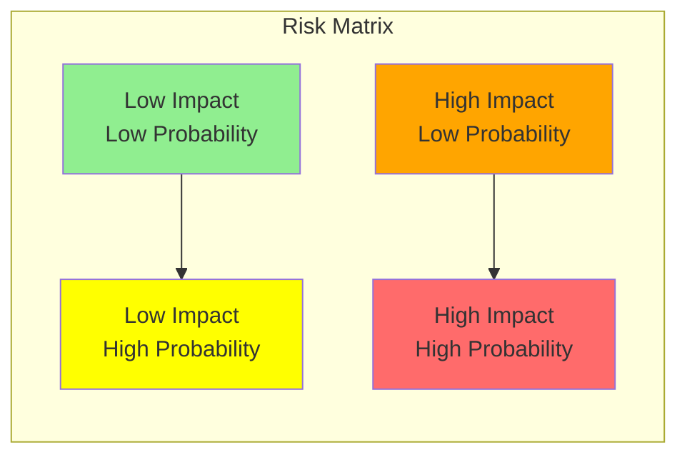

# TechScanIQ Migration Risk Assessment and Mitigation Plan

## Executive Summary

This document provides a comprehensive risk assessment for the TechScanIQ migration from monolithic to microservices architecture. Each risk is analyzed with probability, impact, and detailed mitigation strategies.

## Risk Assessment Matrix



## Risk Categories

### 1. Technical Risks

#### Risk T1: Data Loss During Migration
**Category**: Technical  
**Probability**: Low (20%)  
**Impact**: Critical  
**Risk Score**: 8/10  

**Description**: 
Potential data loss during service extraction, database migrations, or schema changes.

**Mitigation Strategies**:
```yaml
Preventive Measures:
  - Comprehensive backup strategy
  - Blue-green database deployment
  - Incremental migration approach
  - Data validation scripts
  - Rollback procedures

Implementation:
  - Daily automated backups
  - Point-in-time recovery enabled
  - Pre-migration data snapshots
  - Post-migration validation
  - Audit trail maintenance

Contingency Plan:
  - Immediate rollback capability
  - Data recovery procedures
  - Business continuity plan
  - Customer notification process
```

#### Risk T2: Service Communication Failures
**Category**: Technical  
**Probability**: High (70%)  
**Impact**: High  
**Risk Score**: 7/10  

**Description**: 
Inter-service communication failures due to network issues, service discovery problems, or API incompatibilities.

**Mitigation Strategies**:
```typescript
// Circuit Breaker Implementation
class CircuitBreaker {
  private failureCount = 0;
  private lastFailureTime: Date;
  private state: 'CLOSED' | 'OPEN' | 'HALF_OPEN' = 'CLOSED';
  
  async call(fn: Function) {
    if (this.state === 'OPEN') {
      if (Date.now() - this.lastFailureTime > 60000) {
        this.state = 'HALF_OPEN';
      } else {
        throw new Error('Circuit breaker is OPEN');
      }
    }
    
    try {
      const result = await fn();
      this.onSuccess();
      return result;
    } catch (error) {
      this.onFailure();
      throw error;
    }
  }
  
  private onSuccess() {
    this.failureCount = 0;
    this.state = 'CLOSED';
  }
  
  private onFailure() {
    this.failureCount++;
    this.lastFailureTime = new Date();
    if (this.failureCount >= 5) {
      this.state = 'OPEN';
    }
  }
}

// Retry Logic
class RetryManager {
  async execute(fn: Function, maxRetries = 3) {
    let lastError;
    
    for (let i = 0; i < maxRetries; i++) {
      try {
        return await fn();
      } catch (error) {
        lastError = error;
        await this.delay(Math.pow(2, i) * 1000); // Exponential backoff
      }
    }
    
    throw lastError;
  }
  
  private delay(ms: number) {
    return new Promise(resolve => setTimeout(resolve, ms));
  }
}
```

#### Risk T3: Performance Degradation
**Category**: Technical  
**Probability**: Medium (50%)  
**Impact**: High  
**Risk Score**: 6/10  

**Description**: 
System performance may degrade due to additional network hops, serialization overhead, or poor service design.

**Mitigation Strategies**:
```yaml
Performance Testing:
  - Load testing at each phase
  - Latency budgets per service
  - Performance baselines
  - Continuous monitoring

Optimization Techniques:
  - Connection pooling
  - Response caching
  - Request batching
  - Async processing
  - Database query optimization

Monitoring Setup:
  - APM tools (New Relic/DataDog)
  - Custom metrics
  - Real-time dashboards
  - Alerting thresholds
```

#### Risk T4: Security Vulnerabilities
**Category**: Technical  
**Probability**: Low (30%)  
**Impact**: Critical  
**Risk Score**: 8/10  

**Description**: 
Increased attack surface due to distributed architecture and inter-service communication.

**Security Implementation**:
```yaml
Network Security:
  - Service mesh with mTLS
  - Network policies
  - API Gateway security
  - WAF implementation

Application Security:
  - OWASP best practices
  - Dependency scanning
  - Container scanning
  - Secret management (Vault)

Access Control:
  - Zero-trust architecture
  - Service-to-service auth
  - API key rotation
  - Audit logging
```

#### Risk T5: Operational Complexity
**Category**: Technical  
**Probability**: High (80%)  
**Impact**: Medium  
**Risk Score**: 6/10  

**Description**: 
Increased complexity in deployment, monitoring, debugging, and maintenance.

**Mitigation Strategies**:
```yaml
Tooling:
  - Centralized logging (ELK)
  - Distributed tracing (Jaeger)
  - Service mesh (Istio)
  - GitOps (ArgoCD)

Training:
  - Kubernetes workshops
  - Microservices patterns
  - Debugging techniques
  - Incident response

Documentation:
  - Service catalog
  - API documentation
  - Runbooks
  - Architecture diagrams
```

### 2. Business Risks

#### Risk B1: Feature Parity Loss
**Category**: Business  
**Probability**: Medium (40%)  
**Impact**: High  
**Risk Score**: 6/10  

**Description**: 
Missing features or changed behavior during migration affecting user experience.

**Mitigation Strategies**:
```yaml
Testing Strategy:
  - Comprehensive test suite
  - User acceptance testing
  - A/B testing
  - Feature flags

Validation Process:
  - Feature inventory
  - Behavior documentation
  - Regression testing
  - User feedback loops

Rollout Plan:
  - Gradual feature migration
  - Parallel running
  - Quick rollback
  - User communication
```

#### Risk B2: Customer Disruption
**Category**: Business  
**Probability**: Low (20%)  
**Impact**: Critical  
**Risk Score**: 7/10  

**Description**: 
Service interruptions or degraded experience affecting customer satisfaction.

**Mitigation Plan**:
```yaml
Deployment Strategy:
  - Blue-green deployments
  - Canary releases
  - Feature flags
  - Gradual rollout

Communication Plan:
  - Advance notifications
  - Status page updates
  - Support team briefing
  - Compensation policy

Business Continuity:
  - SLA maintenance
  - Incident response
  - Customer support
  - Service credits
```

#### Risk B3: Cost Overruns
**Category**: Business  
**Probability**: Medium (50%)  
**Impact**: Medium  
**Risk Score**: 5/10  

**Description**: 
Migration costs exceeding budget due to infrastructure, tools, or timeline extensions.

**Cost Control Measures**:
```yaml
Budget Management:
  - Detailed cost breakdown
  - Monthly reviews
  - Cost alerts
  - Reserved instances

Optimization:
  - Right-sizing resources
  - Auto-scaling policies
  - Spot instances
  - Cost allocation tags

Monitoring:
  - Cloud cost tools
  - Budget alerts
  - Usage reports
  - Optimization recommendations
```

#### Risk B4: Timeline Delays
**Category**: Business  
**Probability**: High (60%)  
**Impact**: Medium  
**Risk Score**: 5/10  

**Description**: 
Project delays due to technical challenges, resource constraints, or scope changes.

**Schedule Management**:
```yaml
Planning:
  - Buffer time (20%)
  - Critical path analysis
  - Dependency mapping
  - Resource allocation

Tracking:
  - Sprint velocity
  - Burndown charts
  - Risk register
  - Weekly reviews

Mitigation:
  - Scope management
  - Additional resources
  - Parallel workstreams
  - MVP approach
```

#### Risk B5: Team Burnout
**Category**: Business  
**Probability**: Medium (50%)  
**Impact**: High  
**Risk Score**: 6/10  

**Description**: 
Team exhaustion due to migration complexity and ongoing feature development.

**Team Health Strategies**:
```yaml
Workload Management:
  - Realistic planning
  - Rotation schedules
  - Time off policy
  - Workload balancing

Support Systems:
  - Additional contractors
  - Training programs
  - Team building
  - Recognition programs

Well-being:
  - Flexible hours
  - Mental health support
  - Regular check-ins
  - Celebration milestones
```

### 3. Compliance & Legal Risks

#### Risk C1: Data Privacy Violations
**Category**: Compliance  
**Probability**: Low (20%)  
**Impact**: Critical  
**Risk Score**: 8/10  

**Description**: 
GDPR, CCPA, or other privacy regulation violations during migration.

**Compliance Framework**:
```yaml
Data Protection:
  - Encryption at rest
  - Encryption in transit
  - Access controls
  - Audit trails

Privacy Controls:
  - Data minimization
  - Purpose limitation
  - Consent management
  - Right to deletion

Documentation:
  - Privacy impact assessment
  - Data flow diagrams
  - Processing records
  - Incident procedures
```

#### Risk C2: Service Level Agreement Breaches
**Category**: Compliance  
**Probability**: Medium (40%)  
**Impact**: High  
**Risk Score**: 6/10  

**Description**: 
Failure to meet contractual SLAs during migration.

**SLA Protection**:
```yaml
Monitoring:
  - Real-time SLA tracking
  - Proactive alerts
  - Capacity planning
  - Performance tuning

Contingency:
  - Redundant systems
  - Fallback procedures
  - Service credits
  - Communication plan
```

### 4. Organizational Risks

#### Risk O1: Knowledge Silos
**Category**: Organizational  
**Probability**: High (70%)  
**Impact**: Medium  
**Risk Score**: 5/10  

**Description**: 
Critical knowledge concentrated in few team members.

**Knowledge Management**:
```yaml
Documentation:
  - Service wikis
  - Video tutorials
  - Code comments
  - Architecture docs

Sharing:
  - Pair programming
  - Code reviews
  - Tech talks
  - Rotation policy

Training:
  - Onboarding program
  - Cross-training
  - External courses
  - Certifications
```

#### Risk O2: Vendor Lock-in
**Category**: Organizational  
**Probability**: Medium (40%)  
**Impact**: Medium  
**Risk Score**: 4/10  

**Description**: 
Over-dependence on specific cloud providers or tools.

**Portability Strategy**:
```yaml
Architecture:
  - Cloud-agnostic design
  - Standard protocols
  - Open source preference
  - Abstraction layers

Implementation:
  - Kubernetes (portable)
  - Standard APIs
  - Multi-cloud ready
  - Exit strategies
```

## Risk Response Strategies

### 1. Risk Avoidance
- Eliminate high-risk features from initial scope
- Use proven technologies over cutting-edge
- Maintain existing system as fallback

### 2. Risk Reduction
- Implement comprehensive testing
- Use gradual rollout strategies
- Invest in monitoring and alerting

### 3. Risk Transfer
- Cloud provider SLAs
- Insurance policies
- Vendor support contracts

### 4. Risk Acceptance
- Document accepted risks
- Plan for contingencies
- Regular risk reviews

## Risk Monitoring Dashboard

```typescript
interface RiskMetrics {
  technical: {
    errorRate: number;
    latency: number;
    availability: number;
    securityIncidents: number;
  };
  business: {
    customerComplaints: number;
    featureCompleteness: number;
    budgetVariance: number;
    scheduleVariance: number;
  };
  operational: {
    deploymentFailures: number;
    incidentMTTR: number;
    changeFailureRate: number;
    deploymentFrequency: number;
  };
}

class RiskMonitor {
  async collectMetrics(): Promise<RiskMetrics> {
    return {
      technical: await this.collectTechnicalMetrics(),
      business: await this.collectBusinessMetrics(),
      operational: await this.collectOperationalMetrics(),
    };
  }
  
  async evaluateRisks(metrics: RiskMetrics): Promise<RiskAlert[]> {
    const alerts: RiskAlert[] = [];
    
    // Technical risk evaluation
    if (metrics.technical.errorRate > 0.05) {
      alerts.push({
        type: 'TECHNICAL',
        severity: 'HIGH',
        message: 'Error rate exceeds threshold',
        metric: metrics.technical.errorRate,
      });
    }
    
    // Business risk evaluation
    if (metrics.business.budgetVariance > 0.2) {
      alerts.push({
        type: 'BUSINESS',
        severity: 'MEDIUM',
        message: 'Budget variance exceeds 20%',
        metric: metrics.business.budgetVariance,
      });
    }
    
    return alerts;
  }
}
```

## Risk Register

| ID | Risk | Category | Probability | Impact | Score | Status | Owner |
|----|------|----------|-------------|--------|-------|--------|-------|
| T1 | Data Loss | Technical | Low | Critical | 8 | Active | DBA Team |
| T2 | Service Failures | Technical | High | High | 7 | Active | Platform Team |
| T3 | Performance Issues | Technical | Medium | High | 6 | Active | Performance Team |
| T4 | Security Breach | Technical | Low | Critical | 8 | Active | Security Team |
| T5 | Operational Complexity | Technical | High | Medium | 6 | Active | DevOps Team |
| B1 | Feature Parity | Business | Medium | High | 6 | Active | Product Team |
| B2 | Customer Impact | Business | Low | Critical | 7 | Active | Customer Success |
| B3 | Cost Overrun | Business | Medium | Medium | 5 | Active | Finance Team |
| B4 | Timeline Delay | Business | High | Medium | 5 | Active | PMO |
| B5 | Team Burnout | Business | Medium | High | 6 | Active | HR Team |
| C1 | Privacy Violation | Compliance | Low | Critical | 8 | Active | Legal Team |
| C2 | SLA Breach | Compliance | Medium | High | 6 | Active | Operations |
| O1 | Knowledge Silos | Organizational | High | Medium | 5 | Active | Engineering Mgmt |
| O2 | Vendor Lock-in | Organizational | Medium | Medium | 4 | Active | Architecture |

## Risk Review Process

### Weekly Reviews
- Technical risk indicators
- Service health metrics
- Budget tracking
- Timeline progress

### Monthly Reviews
- Full risk register review
- Mitigation effectiveness
- New risk identification
- Strategy adjustments

### Quarterly Reviews
- Executive briefing
- Strategic risk assessment
- Long-term planning
- Policy updates

## Incident Response Plan

### Severity Levels
1. **Critical**: Complete service outage
2. **High**: Major feature unavailable
3. **Medium**: Performance degradation
4. **Low**: Minor issues

### Response Procedures
```yaml
Critical Incident:
  - Immediate: Page on-call engineer
  - 5 min: Assemble incident team
  - 15 min: Initial assessment
  - 30 min: Communication to stakeholders
  - 60 min: Resolution or workaround
  
Post-Incident:
  - RCA within 48 hours
  - Action items identified
  - Process improvements
  - Knowledge base update
```

## Success Indicators

### Risk Reduction Metrics
- Incident frequency < 2/month
- MTTR < 30 minutes
- Security vulnerabilities = 0
- Budget variance < 10%
- Timeline variance < 15%

### Risk Management Maturity
- Proactive risk identification
- Automated risk monitoring
- Regular risk reviews
- Effective mitigation strategies
- Continuous improvement

## Conclusion

Effective risk management is crucial for the success of the TechScanIQ migration. This comprehensive assessment provides:

1. **Clear risk identification** across all categories
2. **Detailed mitigation strategies** for each risk
3. **Monitoring mechanisms** for early detection
4. **Response procedures** for risk events
5. **Success metrics** for risk management

Regular review and updates of this risk assessment will ensure the migration proceeds smoothly with minimal disruption to business operations.