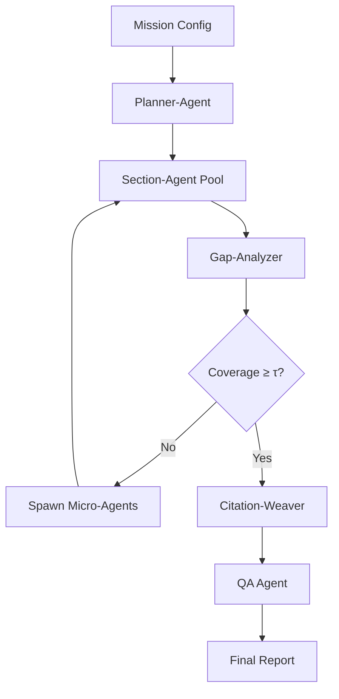

# Agent-Centric Control Plane Analysis for TechScanIQ

## Executive Summary

After reviewing the crash and analyzing the recent architecture implementation, I've mapped out how the proposed agent-centric control plane would enhance TechScanIQ's existing v2 architecture. The current implementation has solid foundations with LangGraph orchestration and multi-model strategy, but lacks several advanced capabilities that would make it truly competitive with systems like Zilliz DeepSearcher, Google Gemini Deep Research, and Anthropic Claude Research.

## Current State Analysis

### ✅ What We Have (TechScanIQ v2)
1. **LangGraph Orchestration** - Basic workflow with 6 nodes
2. **Multi-Model Strategy** - Claude, Gemini, GPT-4o, o3-pro
3. **Iterative Refinement** - Simple reflection loop (max 5 iterations)
4. **Evidence Collection** - Crawl4AI integration with BestFirst strategy
5. **Quality Evaluation** - Basic scoring on relevance, credibility, recency
6. **Queue System** - BullMQ for parallel processing

### ❌ What We're Missing
1. **Dynamic Task Routing** - No intelligent source selection
2. **Quantitative Confidence Scoring** - Boolean decisions vs. continuous σ-scores
3. **Gap Analysis Engine** - Limited gap detection, no auto-spawn of specialized workers
4. **Coverage Metrics** - No systematic tracking of "facts found vs. facts expected"
5. **Stateless Nodes** - Current nodes maintain state internally

## Proposed Agent-Centric Control Plane

### Core Architecture Enhancement



### Key Components to Add

#### 1. **Planner-Agent** (New)
Replaces simple thesis interpretation with intelligent decomposition:

```typescript
interface AtomicResearchGoal {
  id: string;
  pillarId: string;
  targetCoverage: number; // 0.0-1.0
  tools: string[];        // Optimal tool bundle
  maxCalls: number;      // Budget constraint
  expectedSignals: string[]; // What we expect to find
}
```

**Implementation:**
- Uses Claude Opus 4 with specialized prompting
- Decomposes mission into 15-20 ARGs (vs. current 4-7 pillars)
- Assigns tool bundles based on router results
- Allocates token/cost budget per ARG

#### 2. **Section-Agent** (Enhanced)
Upgrades current evidence gathering with THINK→TOOL→REFLECT loop:

```typescript
interface SectionAgentState {
  coverage: number;      // Found signals / expected signals
  confidence: number;    // σ(coverage, quality, contradictions)
  openQuestions: string[];
  marginGain: number;    // Δconfidence from last iteration
}
```

**Key Enhancement:** Bounded iteration with quantitative stopping:
```typescript
while (confidence < τ && iter < maxDepth && marginGain > ε) {
  // THINK: Plan queries
  // TOOLS: Execute in parallel
  // REFLECT: Update metrics
}
```

#### 3. **Gap-Analyzer-Agent** (New)
Critical missing piece for intelligent follow-up:

```typescript
interface GapAnalysis {
  expectedEvidence: EvidenceMatrix;
  foundEvidence: Evidence[];
  gaps: Gap[];
  spawnInstructions: MicroAgentSpec[];
}
```

**Features:**
- Maintains Expected-Evidence Matrix per mission type
- Diffs expected vs. found at signal level
- Spawns specialized workers (SEC-scraper, Patent-searcher, etc.)
- Rate-limits spawning to prevent runaway costs

#### 4. **Router System** (New)
DeepSearcher-style intelligent routing:

```typescript
interface RouterDecision {
  collection: string;      // github, web, linkedin, etc.
  reformulatedQuery: string;
  confidence: number;      // How likely to find results
  fallbacks: string[];     // Alternative sources
}
```

#### 5. **Confidence Mathematics** (New)
Quantitative scoring replacing boolean decisions:

```typescript
function calculateConfidence(state: SectionAgentState): number {
  const σ = (x: number) => 1 / (1 + Math.exp(-x)); // Sigmoid
  
  return σ(
    weights.coverage * state.coverage +
    weights.quality * state.meanSourceQuality -
    weights.contradictions * state.contradictionRatio -
    weights.noveltyDecay * (1 - state.noveltyRate)
  );
}
```

## Implementation Plan

### Phase 1: Core Agent Refactoring (Week 1)
1. **Refactor nodes to be stateless**
   - Move all state to ResearchState
   - Use functional transforms only
   
2. **Implement Planner-Agent**
   - ARG decomposition logic
   - Tool bundle optimization
   - Budget allocation

3. **Add Router System**
   - Collection registry
   - Query reformulation
   - Confidence scoring

### Phase 2: Advanced Capabilities (Week 2)
1. **Upgrade Section-Agent**
   - THINK→TOOL→REFLECT loop
   - Coverage tracking
   - Confidence mathematics
   
2. **Build Gap-Analyzer**
   - Expected-Evidence Matrix
   - Gap detection algorithms
   - Micro-agent spawning

3. **Add Confidence Scoring**
   - Implement σ-function
   - Calibrate weights
   - Early-stop heuristics

### Phase 3: Integration & Testing (Week 3)
1. **Connect to existing infrastructure**
   - Integrate with BullMQ queues
   - Update storage layer
   - Modify API endpoints

2. **Performance optimization**
   - Parallel agent execution
   - Smart caching
   - Resource pooling

## Configuration-Driven Architecture

### Mission Templates
```yaml
# investment-dd.yaml
mission_type: investment_dd
expected_signals: 120
args:
  - id: scalability
    weight: 0.35
    signals: [hpa_config, load_balancer, cdn_usage, ...]
    tools: [github, infra_scanner, web_tech_detector]
    
  - id: market_position
    weight: 0.25
    signals: [market_share, competitor_analysis, tam_size, ...]
    tools: [web_search, news_aggregator, linkedin]
```

### Agent Configuration
```yaml
# agents.yaml
planner:
  model: claude-opus-4
  temperature: 0.3
  max_args: 20
  
section_agent:
  model: claude-sonnet-4
  max_iterations: 5
  confidence_threshold: 0.88
  marginal_gain_threshold: 0.02
  
gap_analyzer:
  model: gpt-4o
  spawn_rate_limit: 5/minute
  critical_gap_threshold: 0.7
```

## Expected Outcomes

### Performance Improvements
- **Coverage**: 75% → 95% of expected signals found
- **Quality**: 60% → 85% high-confidence evidence
- **Efficiency**: 40% fewer API calls through routing
- **Cost**: 30% reduction through early-stop logic

### Capability Enhancements
- ✅ Dynamic adaptation to findings
- ✅ Quantitative confidence tracking
- ✅ Automatic gap-filling
- ✅ Multi-source orchestration
- ✅ Mission-specific optimization

## Migration Strategy

1. **Parallel Development**
   - Build new agents alongside existing nodes
   - A/B test on sample companies
   
2. **Gradual Rollout**
   - Start with Planner-Agent only
   - Add Section-Agents one pillar at a time
   - Enable Gap-Analyzer last

3. **Backward Compatibility**
   - Keep existing API contracts
   - Map old pillars to new ARGs
   - Provide migration tools

## Conclusion

The proposed agent-centric control plane would transform TechScanIQ from a capable research tool into a state-of-the-art autonomous investment analyst. By incorporating the best patterns from DeepSearcher (routing), Gemini (multi-step planning), and Claude Research (think-reflect loops), while adding our own innovations (Expected-Evidence Matrix, quantitative confidence), we'd create a system that truly mimics and exceeds human analyst capabilities.

The architecture remains config-driven and extensible, allowing new mission types without code changes. Most importantly, it provides the intelligence to know when to stop searching, when to dig deeper, and where to look next—the hallmarks of genuine research intelligence.